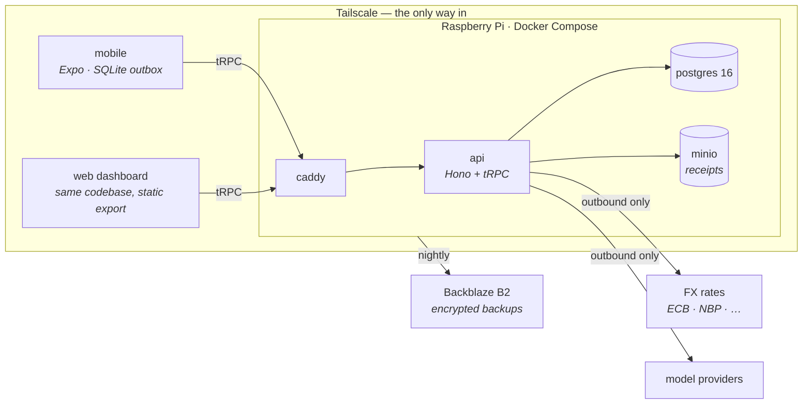

# Waltning

A phone app that is a complete personal finance app on its own — your whole
multi-currency ledger, offline indefinitely, nothing else required to use it.
Add a home backend when you want one (PostgreSQL on a Raspberry Pi you own)
and it becomes the durable copy and record of truth, takes on the heavy work
(bank-statement import, classification, exchange rates), and unlocks a web
dashboard and an LLM agent with typed tools. Passkeys at the front door, no
password anywhere, and never a forwarded port.

Built to replace [Money Manager](https://www.realbyteapps.com/) (no API, no
bulk editing, limited export) and the file-based pipeline that grew around it.

## Why it exists

Commercial finance apps put five years of your money on someone else's server
and give you a subscription and an export button. Waltning inverts that:

- **The phone is a complete finance app, by itself.** Your whole ledger lives
  on the device — every transaction, not a recent window — and it works
  offline indefinitely, from the first time you open it. Nothing else is
  required.
- **A home backend is optional, and it's a real upgrade when you want one.**
  PostgreSQL on a Raspberry Pi becomes the durable copy and the record of
  truth: it does the heavy work (importing statements, classification,
  exchange rates) and unlocks the web dashboard. Adding it is a one-time step
  — your phone's data flows into it, not the other way round. **No port is
  ever forwarded** — reach it over Tailscale from anywhere, over your own LAN,
  or through an outbound-only tunnel the Pi opens itself.
- **You sign in with a passkey, and there is no password to steal.** Face ID or
  a hardware key, `userVerification` required, so it is two factors in one
  gesture. 1Password, Bitwarden and hardware keys all work — nothing is
  restricted to platform authenticators. Recovery is a command on your own
  machine, so there is no code to print and no channel to phish.
  See [`architecture/13`](docs/specification/architecture/13-identity-and-access.md).
- **Multi-currency done right.** Every transaction stores its amount *and* the
  FX rate on its own date. Transfers store both sides, so the realized rate is
  a fact and the spread against the reference rate becomes a visible `FX Cost`.
- **Sync is safe, and not something you have to trigger.** Once you have a
  backend, your own captures drain to it automatically — no sync button, and
  the server is the record of truth, so there's no two-way merge to get wrong:
  a write is one-way intent, and the server admits it or refuses it. Only a
  genuine conflict — the same field changed on two devices — asks which value
  to keep, and tax-relevant fields always ask.
- **Durability graduates, honestly.** On the phone alone, backing up is your
  job: an encrypted export you control. Add the backend and it becomes
  continuous and automatic. This is a real cost, not a footnote — filing-grade
  tax needs the backend too; the phone alone shows tax figures as estimates.
- **AI where it helps, gated where it matters.** The agent gets typed tools,
  not SQL. Reads are free; every write shows a diff card you approve. Receipt
  extraction and voice capture use small per-surface models.
- **Tax isolation is structural.** Exports run under a database role that can
  read one business-only view and nothing else — a personal expense reaching a
  tax report fails loudly instead of slipping through.

## Architecture

This is the shape once you've added the optional backend. The phone alone
needs none of it — it's the same app with the sync arrows removed.



Every external arrow is outbound. The API is the only writer to Postgres, and
every write in the system is a named, validated, audited **operation** in one
registry — the screens and the agent are two consumers of the same registry.
Invariants live in the database (constraints, triggers, role grants), so they
hold even when application code is wrong.

| Piece | What it does |
|---|---|
| `apps/mobile` | Expo/React Native — iOS and web from one codebase. Offline capture, outbox, replica |
| `apps/api` | Hono + tRPC. Operation registry, agent runtime, import pipelines, FX sync, exports |
| `packages/core` | The contract: `money.ts`, shared types, Zod schemas. Runs identically on phone and server |
| `packages/db` | Drizzle schema, hand-written migrations, seed, FX backfill |
| `tools/migrate-mm` | One-shot Money Manager importer with verification gates |

## Getting started

Node ≥ 22, pnpm ≥ 10, Docker.

```sh
git clone https://github.com/VoltLightning/waltning && cd waltning
make setup                   # install, create .env, build the database
make dev                     # api + web, from source
```

`make` is the front door; **pnpm scripts are still the implementation** and Make
never reimplements one — `make verify` runs `pnpm verify`. Two places that both
know how to run the tests is two places that drift, and the one you are not
looking at is always the stale one. `tests/makefile.test.ts` holds them
together: it runs `make help` and asserts every declared target appears, and
that every pnpm script Make names actually exists.

```
make help        every target, with a description
make doctor      what is installed, what is missing, what to run about it
make dev         api + web together, from source
make up          the whole stack as it ships, on :8080
make e2e         check whatever is running, end to end
make verify      the gate
```

`make setup` leaves you with reference data — currencies and the category tree
— and an empty ledger. **`pnpm db:fixture` adds placeholder accounts and
transactions** so the screens have something to show; `pnpm db:fixture --drop`
removes them again. It is deliberately not part of `db:reset`: a fixture that
arrives automatically is a fixture someone eventually mistakes for their own
data.

**`pnpm db:reset` does all four database steps in one** — drop, migrate, grant,
seed. Nothing is permanent yet, so changing the schema should never mean
hesitating: edit `schema.ts`, `pnpm db:generate`, reset.

### Running all three surfaces

`make dev` starts the API and the web app together and stops both on Ctrl-C.
The simulator is a third process, and Metro's interactive key commands only
work when it owns a terminal:

```sh
make dev        # api :3000 + web :8081
make dev-web    # just Metro, interactive
make dev-ios    # the same app in the simulator
```

Then `make e2e` checks the whole chain against what is actually running: the
probes, that a response authenticates under Rule 0, that a read returns seeded
rows with its declared fields, and that a refusal comes back as a domain error
rather than a transport failure. It is read-only; `pnpm e2e --write` also
creates one placeholder row and tells you its id.
`make appliance-e2e` runs the identical check against the containers.

**The web surface needs one setting the others do not.** Metro serves the bundle
on `:8081` and the API answers on `:3000`, which a browser treats as two
origins. Set `DEV_CORS_ORIGIN=http://localhost:8081` in `.env` for the browser;
without it the page loads and every request fails as *no answer*. Nothing else
needs it — the simulator sends no `Origin`, and in production Caddy serves the
bundle and proxies `/trpc` on one host name, so there is no second origin to
allow. The setting is off unless set, refuses `*`, and refuses anything that is
not loopback.

**The simulator needs Xcode proper**, not just the command-line tools:
`sudo xcode-select -s /Applications/Xcode.app/Contents/Developer`, then
`xcodebuild -downloadPlatform iOS` for a runtime. A real device is different
again — loopback on a phone is the phone — so it needs
`EXPO_PUBLIC_API_URL` pointing at the tailnet host. The app refuses to guess
rather than failing every request in a way that looks like a server outage.

The three database URLs are deliberate: `MIGRATE_` is the superuser (migrations
only), `APP_` is what the API runs as, `EXPORT_` can read a single tax view.
The separation *is* the tax guarantee — don't collapse them.

`pnpm test` runs the suite against a real Postgres — each test file gets its own
database, cloned from a migrated template, and dropped afterwards. There are no
database mocks.

`pnpm verify` (Biome + strict TypeScript, ~2 s) is the gate; the pre-commit
hook runs it for you.

### Running it as it ships

The appliance is three containers: Postgres, the API, and Caddy serving the web
bundle and proxying `/trpc` on **one host name**.

```sh
make up          # build, start, wait for health, print /readyz
make ps          # what is running
make down        # stop it, keep the development database
```

Six services: Postgres, a one-shot `migrate`, the API, MinIO, a one-shot bucket
init, and Caddy. **`migrate` is separate on purpose** — the API does not start
unless it exits 0, so a failed migration stops the deploy instead of leaving an
API serving against a schema it does not match.

That single origin is why `DEV_CORS_ORIGIN` exists only in development — there
is no second origin here to allow, and the compose stack deliberately does not
set it. `BUILD_SHA` reaches both images from the same command, because the
client compares its own build against the one `/healthz` reports; two sources
would produce a permanent false mismatch.

On the Pi, `SITE_ADDRESS` is the tailnet name, which is what makes Caddy fetch
and renew the Tailscale-issued certificate. There is no public name and no
public certificate. Locally it defaults to `:8080` over plain HTTP so the
routing can be checked on a machine with no tailnet — the only difference
between the two, which is the point.

**LAN mode needs a real certificate, not plain HTTP**, and that is a correctness
requirement rather than a preference: the session cookie is `Secure`, browsers
do not send `Secure` cookies over HTTP, and the result is being logged out on
every request rather than a system that is merely less private. A DNS-01
certificate for a name resolving to the private address costs nothing and
exposes nothing.

**Deploying to a Pi** — Tailscale, nightly encrypted dumps to B2, the restore
runbook: see
[`docs/specification/architecture/05-deployment.md`](docs/specification/architecture/05-deployment.md).

## Stack

TypeScript throughout. Hono + tRPC + Drizzle over PostgreSQL 16; Expo for
mobile and web from one codebase; Docker Compose on a Raspberry Pi behind
Tailscale. Money is `numeric(20,8)` decimal strings end to end — never floats.
Every layer choice, and every refusal, has its reasoning recorded in
[`SPEC.md` §4.3](SPEC.md).

## Documentation

| | |
|---|---|
| [`SPEC.md`](SPEC.md) | Architecture, data model, FX semantics, security, tax layer — with reasoning |
| [`docs/specification/`](docs/specification/) | Operations registry, computations, 17 journeys, 31 screens, design system |
| [`docs/specification/defects.md`](docs/specification/defects.md) | 101 findings from ten adversarial reviews, and their status |
| [`TAXONOMY.md`](TAXONOMY.md) | The category tree, derived from five years of data |
| [Wiki](https://github.com/VoltLightning/waltning/wiki) | Orientation — where to start, and the reasoning behind the choices |

The wiki is published from [`docs/wiki/`](docs/wiki/), not edited in place: a
GitHub wiki is a separate repository the pre-commit hook cannot reach, and this
one is public. `pnpm wiki:check` runs the sweep and the link checks;
`pnpm wiki:publish` mirrors.

## Data handling

This repository contains no financial data. Ledger contents, statements, dumps
and backups are excluded by `.gitignore` and refused by the pre-commit hook
even when force-added. People and institutions in examples are placeholders
(`Bank A · PLN`, invented names); structural facts — row counts, currencies,
tax scheme — are real.

## Contributing

Actively developed, changes fast — read [CONTRIBUTING.md](CONTRIBUTING.md) and
open an issue before building anything.

## License

[Apache 2.0](LICENSE) — © 2026 Vitaliy Pankov.
