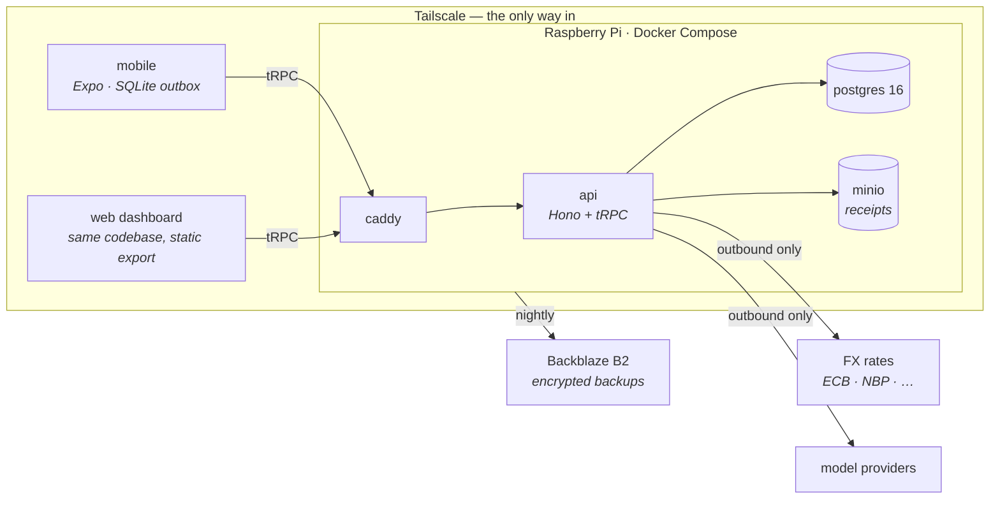

# Waltning

Self-hosted personal finance: a mobile app that works offline, a web dashboard,
receipt scanning, bank-statement import, and an LLM agent with typed tools —
over a multi-currency Postgres ledger that runs on your own hardware and is
reachable only through your own VPN.

Built to replace [Money Manager](https://www.realbyteapps.com/) (no API, no
bulk editing, limited export) and the file-based pipeline that grew around it.

## Why it exists

Commercial finance apps put five years of your money on someone else's server
and give you a subscription and an export button. Waltning inverts that:

- **You own the ledger.** PostgreSQL on a Raspberry Pi at home. No public
  ingress — every device connects over Tailscale, so there is no login page on
  the internet to find.
- **Multi-currency done right.** Every transaction stores its amount *and* the
  FX rate on its own date. Transfers store both sides, so the realized rate is
  a fact and the spread against the reference rate becomes a visible `FX Cost`.
- **The phone works offline, indefinitely.** Capture queues into a local
  outbox; a server checkpoint plus the outbox reconstructs your figures without
  the server. Sync is explicit and bidirectional.
- **AI where it helps, gated where it matters.** The agent gets typed tools,
  not SQL. Reads are free; every write shows a diff card you approve. Receipt
  extraction and voice capture use small per-surface models.
- **Tax isolation is structural.** Exports run under a database role that can
  read one business-only view and nothing else — a personal expense reaching a
  tax report fails loudly instead of slipping through.

## Architecture



Every external arrow is outbound. The API is the only writer to Postgres, and
every write in the system is a named, validated, audited **operation** in one
registry — the screens and the agent are two consumers of the same registry.
Invariants live in the database (constraints, triggers, role grants), so they
hold even when application code is wrong.

| Piece | What it does |
|---|---|
| `apps/mobile` | Expo/React Native — iOS and web from one codebase. Offline capture, outbox, replica |
| `apps/api` | Hono + tRPC. Operation registry, agent runtime, import pipelines, FX sync, exports |
| `packages/core` | The contract: `money.ts`, shared types, Zod schemas. Runs identically on phone and server |
| `packages/db` | Drizzle schema, hand-written migrations, seed, FX backfill |
| `tools/migrate-mm` | One-shot Money Manager importer with verification gates |

## Getting started

Node ≥ 22, pnpm ≥ 10, Docker.

```sh
git clone https://github.com/VoltLightning/waltning && cd waltning
pnpm install                 # also installs the git hooks
cp .env.example .env         # fill it in — note the three database URLs
pnpm db:up                   # postgres on 127.0.0.1, loopback only
pnpm db:migrate              # ten migrations, in order
pnpm db:seed                 # currencies + category tree
pnpm dev:api                 # the API on 127.0.0.1:3000
```

**`pnpm db:reset` does all four database steps in one** — drop, migrate, grant,
seed. Nothing is permanent yet, so changing the schema should never mean
hesitating: edit `schema.ts`, `pnpm db:generate`, reset.

### Running all three surfaces

One Expo codebase serves the phone and the browser, and the API is a separate
process — so this is three terminals, not one:

```sh
pnpm dev:api    # the API           127.0.0.1:3000
pnpm dev:web    # React Native Web  localhost:8081
pnpm dev:ios    # the same app in the iOS simulator
```

Then `pnpm e2e` checks the whole chain against what is actually running: the
probes, that a response authenticates under Rule 0, that a read returns seeded
rows with its declared fields, and that a refusal comes back as a domain error
rather than a transport failure. It is read-only; `pnpm e2e --write` also
creates one placeholder row and tells you its id.

**The web surface needs one setting the others do not.** Metro serves the bundle
on `:8081` and the API answers on `:3000`, which a browser treats as two
origins. Set `DEV_CORS_ORIGIN=http://localhost:8081` in `.env` for the browser;
without it the page loads and every request fails as *no answer*. Nothing else
needs it — the simulator sends no `Origin`, and in production Caddy serves the
bundle and proxies `/trpc` on one host name, so there is no second origin to
allow. The setting is off unless set, refuses `*`, and refuses anything that is
not loopback.

**The simulator needs Xcode proper**, not just the command-line tools:
`sudo xcode-select -s /Applications/Xcode.app/Contents/Developer`, then
`xcodebuild -downloadPlatform iOS` for a runtime. A real device is different
again — loopback on a phone is the phone — so it needs
`EXPO_PUBLIC_API_URL` pointing at the tailnet host. The app refuses to guess
rather than failing every request in a way that looks like a server outage.

The three database URLs are deliberate: `MIGRATE_` is the superuser (migrations
only), `APP_` is what the API runs as, `EXPORT_` can read a single tax view.
The separation *is* the tax guarantee — don't collapse them.

`pnpm test` runs the suite against a real Postgres — each test file gets its own
database, cloned from a migrated template, and dropped afterwards. There are no
database mocks.

`pnpm verify` (Biome + strict TypeScript, ~2 s) is the gate; the pre-commit
hook runs it for you.

**Deploying to a Pi** — Compose, Tailscale, Caddy with tailnet certs, nightly
encrypted dumps to B2: see
[`docs/specification/architecture/05-deployment.md`](docs/specification/architecture/05-deployment.md).

## Stack

TypeScript throughout. Hono + tRPC + Drizzle over PostgreSQL 16; Expo for
mobile and web from one codebase; Docker Compose on a Raspberry Pi behind
Tailscale. Money is `numeric(20,8)` decimal strings end to end — never floats.
Every layer choice, and every refusal, has its reasoning recorded in
[`SPEC.md` §4.3](SPEC.md).

## Documentation

| | |
|---|---|
| [`SPEC.md`](SPEC.md) | Architecture, data model, FX semantics, security, tax layer — with reasoning |
| [`docs/specification/`](docs/specification/) | Operations registry, computations, 17 journeys, 31 screens, design system |
| [`docs/specification/defects.md`](docs/specification/defects.md) | 101 findings from ten adversarial reviews, and their status |
| [`TAXONOMY.md`](TAXONOMY.md) | The category tree, derived from five years of data |
| [Wiki](https://github.com/VoltLightning/waltning/wiki) | Orientation — where to start, and the reasoning behind the choices |

The wiki is published from [`docs/wiki/`](docs/wiki/), not edited in place: a
GitHub wiki is a separate repository the pre-commit hook cannot reach, and this
one is public. `pnpm wiki:check` runs the sweep and the link checks;
`pnpm wiki:publish` mirrors.

## Data handling

This repository contains no financial data. Ledger contents, statements, dumps
and backups are excluded by `.gitignore` and refused by the pre-commit hook
even when force-added. People and institutions in examples are placeholders
(`Bank A · PLN`, invented names); structural facts — row counts, currencies,
tax scheme — are real.

## Contributing

Actively developed, changes fast — read [CONTRIBUTING.md](CONTRIBUTING.md) and
open an issue before building anything.

## License

[Apache 2.0](LICENSE) — © 2026 Vitaliy Pankov.
