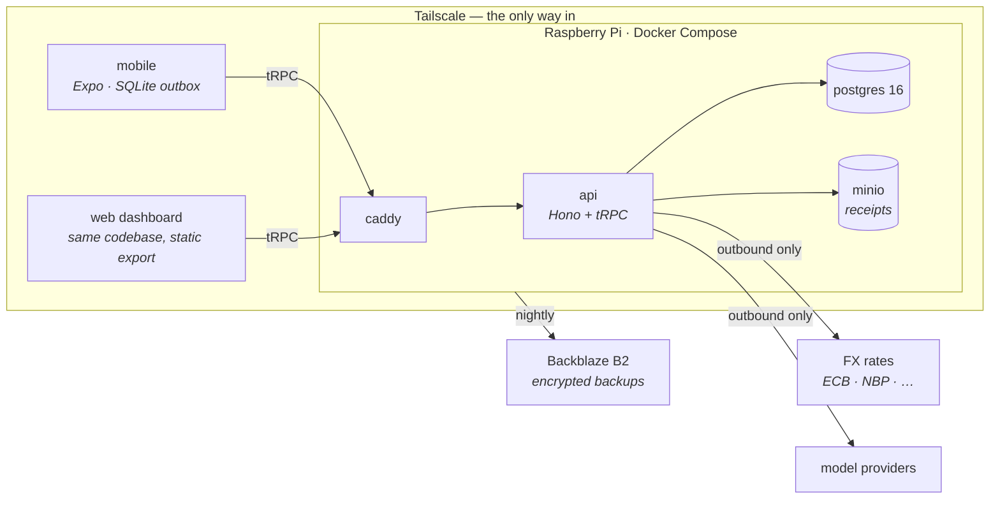

# Waltning

A personal finance app for your phone that works completely on its own — your
whole multi-currency history, offline, with no account and no server required.

When you want more, you add a small backend you run yourself (PostgreSQL on a
Raspberry Pi). It becomes your durable backup, runs a web dashboard, and takes
over the slow work like importing bank statements. It's optional: the phone app
is the product, and the backend makes it better.

## What problem it solves

Commercial finance apps keep years of your money on their servers and hand you
a subscription and an export button. The obvious alternative — a local app like
[Money Manager](https://www.realbyteapps.com/) — has no API, no bulk editing,
and weak export, so anything beyond typing in single transactions turns into a
pile of scripts.

Waltning is the finance app you fully own, without giving up the things that
made the commercial one convenient: it syncs, it has a web dashboard, it can
import your statements, and it does not phone home to anyone.

## How it's built

The core idea is one line: **the phone is complete, the server is
authoritative.** Those are two different jobs.

- The **phone** holds your entire ledger and does everything you do day to day —
  add, edit, search, see balances — with no network. It is complete.
- The **server**, when you add one, is the source of truth. It admits every
  write, holds the guarantees that have to be enforced (like keeping business
  and personal money separate for tax), and does the heavy lifting.

You never get two copies fighting, because there is only ever one record of
truth. Your phone captures offline, and when you next open the app with a
connection it sends what you wrote — no sync button, no messy two-way merge. If
the same field really was changed in two places, the app asks which to keep;
for anything tax-related, it always asks.

A few principles hold the whole thing together:

- **One list of operations.** Every write in the system — from a screen or from
  the AI agent — is a named, validated, audited operation in a single registry.
  The screens and the agent are just two users of the same list, so they can't
  drift apart.
- **The database enforces the rules.** Money constraints, tax isolation, closed
  periods — these are Postgres constraints, triggers, and role grants, not app
  code. They hold even when the code has a bug.
- **Nothing is exposed to the internet.** No port is ever forwarded. You reach
  your backend over Tailscale (a private network of your own devices), over your
  home wifi, or through an outbound-only tunnel the Pi opens itself.
- **You sign in with a passkey — there's no password.** Face ID or a hardware
  key, and it works with 1Password, Bitwarden, or any authenticator. Recovery is
  a command you run on your own machine, so there's nothing to phish.
- **Multi-currency is done properly.** Every transaction stores its amount and
  the exchange rate on its own date; transfers store both sides, so what a
  currency swap really cost you is a visible number, not an estimate.
- **AI is on tap where it helps, gated where it matters.** The agent gets typed
  tools, not raw database access. It can read freely; every write it proposes
  shows you a card to approve first.

### The shape, once you've added a backend

The phone alone needs none of this — it's the same app with the sync arrows
removed.



| Piece | What it does |
|---|---|
| `apps/mobile` | Expo / React Native — iOS and web from one codebase. Offline capture, the local ledger, and the outbox |
| `apps/api` | Hono + tRPC. The operation registry, the agent, statement import, FX sync, exports |
| `packages/core` | The shared contract: money math, types, validation. Runs identically on phone and server |
| `packages/db` | The Postgres schema, migrations, seed data, and FX backfill |
| `tools/migrate-mm` | A one-shot importer that brings a Money Manager backup in and checks it landed correctly |

The whole design, and the reasoning behind every choice, is in
[`SPEC.md`](SPEC.md) and [`docs/specification/`](docs/specification/).

## Setting up the repo

You need **Node 22 or newer, pnpm 10 or newer, and Docker**.

```sh
git clone https://github.com/VoltLightning/waltning && cd waltning
make setup      # installs everything, creates your .env, builds the database
make dev        # runs the API and the web app together
```

`make` is the front door. Behind it, the real work lives in `pnpm` scripts, and
`make` only ever calls them (`make verify` runs `pnpm verify`, and so on) — so
there's one place that knows how to do each thing, not two that can disagree.

Run `make help` any time to see every command with a one-line description. The
ones you'll use most:

```
make dev        API + web together, from source (Ctrl-C stops both)
make doctor     checks what's installed and tells you what to fix
make up         the whole thing as it ships, in containers, on :8080
make e2e        its own database, API, and browser — end to end
make verify     the gate: formatting, types, and tests
```

### Getting data on the screen

`make setup` gives you the reference data (currencies, the category tree) and an
**empty ledger** — so the app runs, but there's nothing to look at yet.

- `pnpm db:fixture` adds placeholder accounts and transactions so the screens
  have content; `pnpm db:fixture --drop` removes them. This is separate from
  setup on purpose, so fake data never quietly shows up looking real.
- `pnpm db:reset` rebuilds the database from scratch in one step (drop, migrate,
  set up roles, seed). Nothing is permanent yet, so changing the schema is
  cheap: edit `schema.ts`, run `pnpm db:generate`, then reset.

### Running all three surfaces at once

`make dev` starts the API and the web app and stops both with Ctrl-C. The iOS
simulator is a separate process, because Metro needs its own terminal:

```sh
make dev        # API on :3000, web on :8081
make dev-web    # just the web app (keeps Metro's keyboard controls)
make dev-ios    # the same app in the iOS simulator
```

Two things need a bit of setup the first time:

- **The web app needs one line in `.env`.** Metro serves the page on `:8081` and
  the API answers on `:3000`, and a browser treats those as two different sites.
  Add `DEV_CORS_ORIGIN=http://localhost:8081` and the browser can talk to the
  API. Without it the page loads but every request silently fails. Only the
  browser needs this — the simulator and production don't.
- **The simulator needs full Xcode**, not just the command-line tools. Run
  `sudo xcode-select -s /Applications/Xcode.app/Contents/Developer`, then
  `xcodebuild -downloadPlatform iOS` to get a runtime. A real phone running
  the **web app** is different again: it can't reach your Mac's `localhost`,
  so point it at your machine with `EXPO_PUBLIC_API_URL`. This is unrelated to
  the native route below, which never makes a network call at all.

For the native route, `pnpm --filter @waltning/mobile dev` starts Expo Go alone
(`apps/mobile/README.md` has the `a`/`i`/`w` shortcuts) — the native preview
doesn't call the API, so there's normally nothing to run alongside it.
`pnpm dev:all` is `make dev`'s pnpm-spelled sibling for this surface: the same
pattern — Postgres first, and waited for (`pnpm db:ready`, the same script
`make db` calls — `pnpm db:up` alone only starts the container, it does not
wait), then two processes together, Ctrl-C stops both — for the API and Expo
Go instead of the API and the web app. One
thing it can't do: under `pnpm --parallel`'s piped output Expo's keyboard
shortcuts (`a`/`i`/`w`) don't work, so reach for `pnpm dev:android`,
`pnpm dev:ios`, or `pnpm dev:web` when you need one of those interactively.

### Checking it works

```sh
make e2e             # spins up its own database, API, and web bundle
make appliance-e2e   # the same suite, against the containers instead
pnpm test            # the full suite, against a real Postgres
pnpm verify          # the full gate — format, types, tests, and the visual suite
pnpm verify:fast     # the same, minus the visual suite (no Playwright)
```

The pre-commit hook runs one or the other for you, never both and never
neither: `pnpm verify:fast` when nothing staged can move a rendered pixel,
`pnpm verify` when something can — `.githooks/needs-visual.sh` is what
decides which. Run either by hand the same way it runs them.

`make e2e` runs the Playwright suite. It needs only Postgres running
(`pnpm db:up`) — from there it clones and seeds its own scratch database,
starts its own API and web bundle on ports it probes for itself, runs
five API probes and five journeys through a real browser, and tears
everything down again.
Nothing else needs to already be running, and nothing it does touches your
own development ledger.

For a quick read-only check of *whatever you already have running*
instead — the health checks, a real read returning seeded rows, and a
rejected write coming back as a proper error rather than a network
failure — there is `pnpm e2e:smoke` (add `--write` to also create one
placeholder row).

`pnpm test` runs against a real Postgres — each test file gets its own database
cloned from a migrated template, then dropped. There are no database mocks.

### One thing not to change: the three database URLs

The `.env` file has three connection strings, and they are deliberate:

- `MIGRATE_` is the superuser, used only for migrations.
- `APP_` is what the API runs as day to day.
- `EXPORT_` can read a single tax-only view and nothing else.

That separation is how the tax guarantee is actually enforced — a personal
expense physically cannot reach a tax export. Don't collapse them into one.

### Running it the way it ships

The real deployment is a handful of containers behind Caddy:

```sh
make up      # build, start, wait for health, print status
make ps      # what's running
make down    # stop it, keep your dev database
```

Migrations run as a separate one-shot container, and the API refuses to start
until they succeed — so a broken migration stops the deploy instead of leaving
the API running against a schema it doesn't match. The full Pi deployment
(Tailscale, encrypted nightly backups, the restore steps) is in
[`docs/specification/architecture/05-deployment.md`](docs/specification/architecture/05-deployment.md).

## The compromises we're making

This design trades some things away on purpose. They're worth knowing before you
decide it fits you.

- **Backup on the phone alone is your job.** With no backend, the app keeps your
  data safe with an encrypted export you control — but you have to make it
  happen. Add the backend and backups become automatic. There's no free
  durability without a second copy somewhere.
- **Real tax filing needs the backend.** The phone shows tax figures, but as
  estimates. The guarantee that keeps personal money out of a tax return is a
  database role, and a phone has no equivalent — so filing-grade numbers only
  come from the server.
- **No editing the same record on two offline phones at once.** There is one
  writer of record, and conflicts are resolved by asking you, not by a clever
  automatic merge. This is a single-person finance app, not real-time
  collaboration.
- **Reaching it from outside your home means running Tailscale** on that device.
  There's a public-URL option, but it's the weakest of the three and needs a
  real domain — so passkeys and secure sign-in work. It's offered honestly, as
  the weaker choice.
- **One user.** There's no multi-tenant, multi-person mode. Sharing a ledger
  with someone else is a data-model question we haven't answered, not a setting.
- **It's early.** The design is far ahead of the code, and both move fast. Read
  [CONTRIBUTING.md](CONTRIBUTING.md) and open an issue before building anything.

## Reference

| | |
|---|---|
| [`SPEC.md`](SPEC.md) | The full design: architecture, data model, FX, security, tax — with the reasoning |
| [`docs/specification/`](docs/specification/) | Operations, computations, the journeys, the screens, the design system |
| [`docs/specification/defects.md`](docs/specification/defects.md) | Findings from the adversarial reviews, and their status |
| [`TAXONOMY.md`](docs/TAXONOMY.md) | The category tree, built from five years of real data |
| [Wiki](https://github.com/VoltLightning/waltning/wiki) | A gentler orientation — where to start and why things are the way they are |

The stack is TypeScript throughout: Hono, tRPC, and Drizzle over PostgreSQL 16;
Expo for phone and web from one codebase; Docker Compose on a Raspberry Pi
behind Tailscale. Money is stored as exact decimal strings, never floating-point
numbers.

**This repository contains no financial data.** Real ledger contents are
excluded by `.gitignore` and blocked by the pre-commit hook. People and banks in
examples are placeholders (`Bank A · PLN`, invented names); only structural
facts like row counts and currencies are real.

[Apache 2.0](LICENSE) — © 2026 Vitaliy Pankov.
