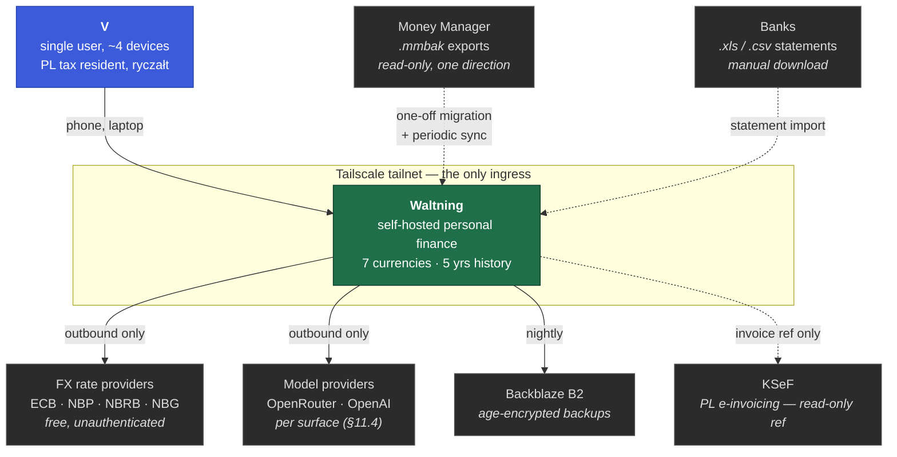
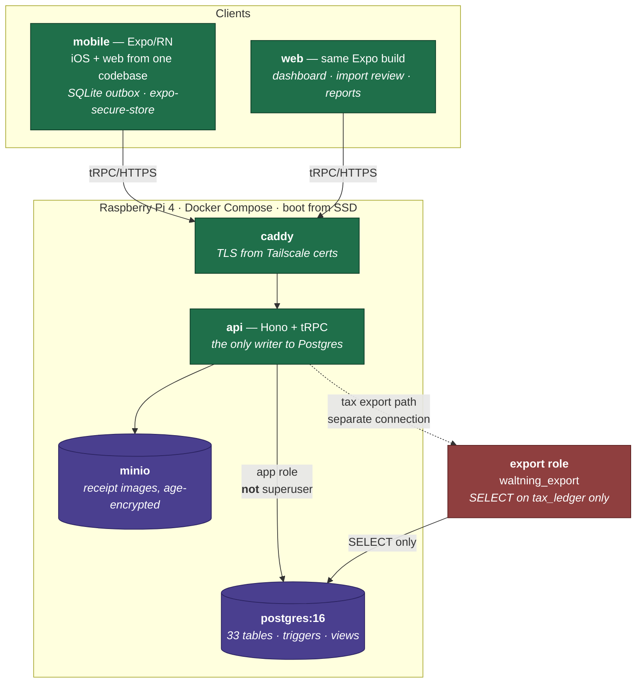
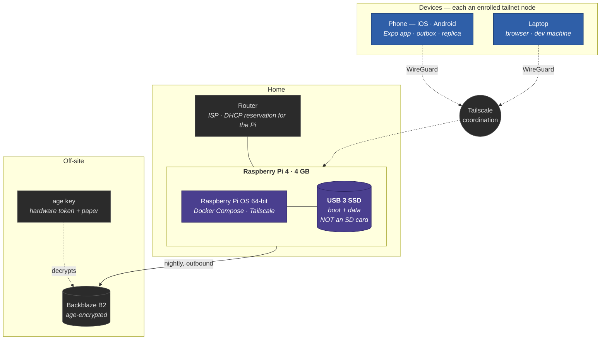
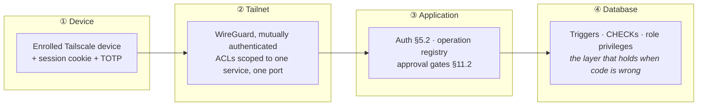

# 1 · Context and containers

C4 levels 1 and 2. Level 3 is [`02-components.md`](02-components.md).

`SPEC.md` §4.1 draws this as ASCII and stops at the container boundary. What an
engineering team needs beyond that picture is which arrows are trust boundaries,
which are the only outbound paths, and what happens when each dependency is
unavailable — because the interesting failures are all on the edges.

---

## Level 1 · System context

**Every external arrow is outbound or manual.** Nothing on the internet can
initiate a connection to Waltning; there is no public ingress, no webhook, no
inbound OAuth callback. That is the §5.1 access model expressed as a diagram,
and it is the single largest reason the security surface is small enough for one
person to reason about.

**Waltning is not the filing path** (§13.5). KSeF is a reference, not an
integration — the tax return is filed through the official channel, and Waltning
produces the workbook that informs it. Treat any story that makes Waltning
authoritative for filing as out of scope.

### What each dependency's absence costs

| Dependency | If unavailable | Degradation |
|---|---|---|
| FX providers | Rates go stale | Writes **still succeed** — `fx_rate` is required, so the last known rate is carried forward with `fx_rate_estimated = true` and a bounded carry window. Never blocks entry |
| Model providers | Classification and agent unavailable | Manual entry and all deterministic paths unaffected. The import review queue still works, unclassified |
| Backblaze B2 | Offsite copy stops | Local nightly dump continues. **Silent failure is the risk** — surfaced on S30 beside backup status |
| Tailscale | **Total loss of access** | Accepted (§5.1). Every device must run it; the alternative is a public login page |
| MinIO | Receipt images unreadable | Ledger fully functional; receipts degrade to their extracted `transaction_lines` |

---

## Level 2 · Containers

### The two database identities, and why this is a container-level concern

This is the part of the diagram that carries a guarantee rather than a
description.

| Identity | Privileges | Used by |
|---|---|---|
| `waltning_app` | DML on all tables. **Not a superuser** | The API, for everything |
| `waltning_export` | `SELECT` on `tax_ledger` and nothing else; enumerated `REVOKE`s on the eight tables holding personal rows | The tax export path only |

`POSTGRES_USER` is the bootstrap **superuser**, and a superuser bypasses every
`GRANT` — so T1 is unenforceable until the API stops connecting as it. The
export path must take its connection **explicitly**: `createDb()`'s default
argument silently hands back the superuser, which converts *fails loudly* into
*succeeds quietly*.

Migration `0005` creates the role and the view; `verify_t1()` checks all three
ways it can break. See [`03-domain-model.md`](03-domain-model.md) § T1.

### Container responsibilities

| Container | Owns | Explicitly does not |
|---|---|---|
| `mobile` | Capture, offline outbox, optimistic UI, secure token storage | Hold any provider API key. **All model calls originate from `api`** (§5.3) |
| `api` | Every write to Postgres, the operation registry, the agent runtime, FX sync, import pipelines, export | Serve any port outside the tailnet |
| `postgres` | The ledger, and the invariants that cannot be expressed in application code (§6.5) | Anything reachable from outside the compose network |
| `minio` | Receipt blobs, S3-compatible so offsite is configuration | Store anything unencrypted |
| `caddy` | TLS termination using Tailscale-issued certs | Public certificate issuance — there is no public name |

**`api` is a single process, deliberately.** Four "modules" appear inside it in
§4.1 — ledger, import, receipts, agent, export — and they are namespaces, not
services. One Pi, one user: a message bus between them would add failure modes
and buy nothing. The seam that matters is the *operation registry*, not a
network boundary, and that seam is enforced by types.

---

## The physical layer

Containers say what runs; this says what it runs **on**. The distinction matters
here more than in most systems, because the whole design rests on physical
custody (§1.3, O17) and because the hardware has exactly one of everything.

### The bill of materials, and what each part costs when it fails

| Part | Spec | If it dies |
|---|---|---|
| **Raspberry Pi 4** | 4 GB. 8 GB is headroom, not a requirement | Replaceable in a day. Restore from B2 and **re-apply `0005`** — roles are not in the dump |
| **USB 3 SSD** | Boot **and** data. Never an SD card | **The single most likely failure** (R6, High over years). Nightly dumps bound the loss to a day |
| Power supply | Official 5 V 3 A | Undervoltage corrupts writes silently before it kills the board. `vcgencmd get_throttled` belongs on S30 |
| Router | Any. **DHCP reservation** for the Pi | Tailscale hides most of it — the tailnet IP does not change |
| Cooling | Passive is enough at this load | Thermal throttling shows up as latency, not failure, which makes it hard to spot |

**Boot from SSD, never an SD card.** SD cards fail under database write patterns
and they fail *silently for a while first* — which is the worst shape a storage
failure can have for a ledger, because the corruption is in the backups by the
time you notice.

### One of everything

There is no redundancy anywhere in the home box, and that is a deliberate
accepted risk rather than an oversight (§15, `06-quality-attributes.md` — *there
is no availability target, and that is a decision*).

What compensates, and what each actually covers:

| Compensation | Covers | Does not cover |
|---|---|---|
| Nightly `pg_dump` → age-encrypted → B2 | Total hardware loss, to within a day | Anything since the last dump |
| **Quarterly restore drill** | The dump being unrestorable — the failure nobody notices until it matters | — |
| The phone's replica | Reading your history while the Pi is dead | Writing anything the server must admit |
| The phone's outbox | **Capture continues with the Pi off**, indefinitely | Figures classed **S** |

The phone is the interesting one: it makes the hardware's single point of failure
survivable *for the thing you do most*. You can capture through a week of the Pi
being down and lose nothing.

**The `age` key is the real single point of failure**, not the Pi. Hardware
token plus a paper copy off-site, because a B2 bucket you cannot decrypt is
indistinguishable from no backup at all.

---

## Trust boundaries

**Four layers, and the design assumes each will individually fail.** ② is the
one §5.1 calls categorically strong; ③ is the one a bug lives in; ④ is the one
that has actually caught things — every C-class defect in `defects.md` that was
*enforced* rather than *asserted* was enforced at ④.

The ordering matters for the build sequence: `build-order.md`'s Phase 0.5 exists
because ② and ③ were scheduled at week 15 while real data landed in week 1.
