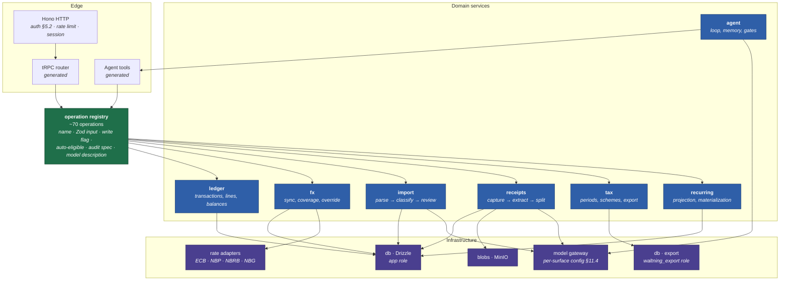
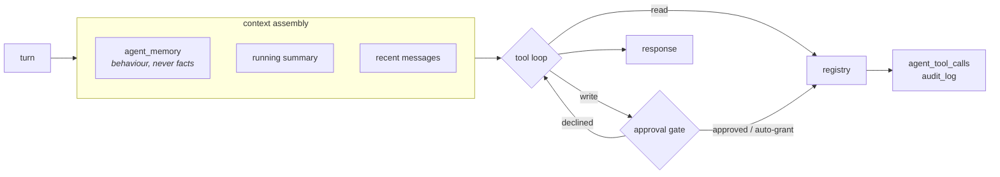
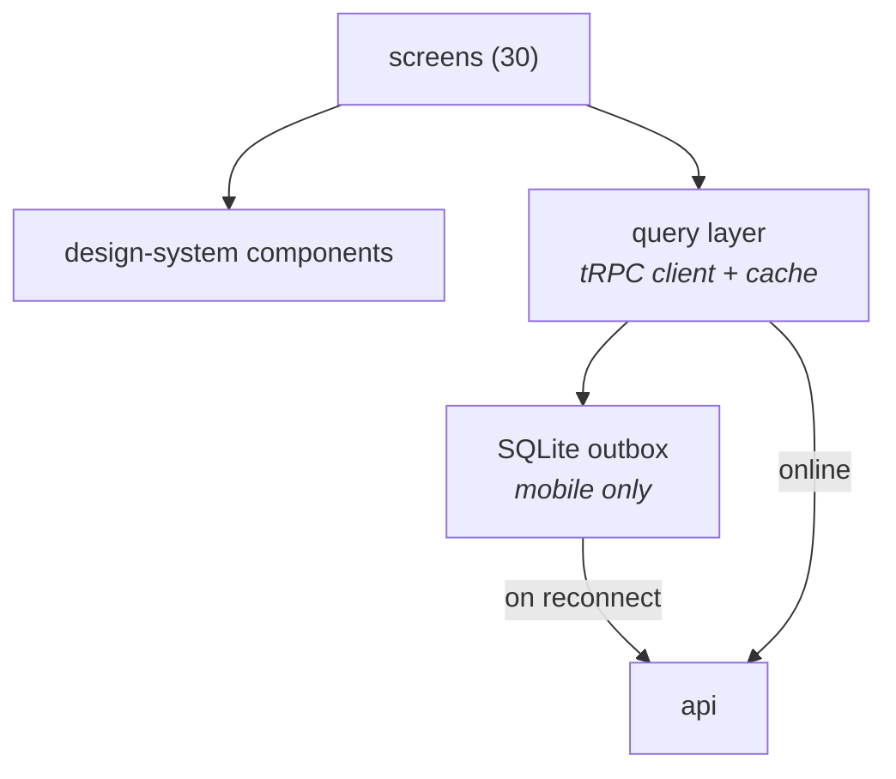

# 2 · Components

C4 level 3, inside the `api` container. Level 2 is
[`01-context-and-containers.md`](01-context-and-containers.md).

`api` is one process. These are namespaces with enforced seams, not services —
one Pi and one user make a message bus pure cost. The seam that carries weight is
the **operation registry**, and it is enforced by types rather than by a network
hop.

---

## The shape



**Read the two generated boxes as the whole point.** The tRPC router and the
agent's tool list are *both emitted from the registry*. Neither is hand-written,
so they cannot drift; adding a screen action adds an agent tool for free. This is
§11.0, and it is the single most load-bearing structural decision in the API.

**`agent` sits above the registry, not beside it.** It is a consumer, like the
UI. It holds the loop, the memory, and the approval gating — but every write it
performs goes through the same registry entry the UI calls, with the same
validation and the same audit row.

**`tax` is the only service that does not use the app's database handle.** It
takes the `waltning_export` connection explicitly, because a default argument
would silently hand it the superuser and convert a hard failure into a quiet
success (§13.1).

---

## Registry entry — the contract every operation satisfies

```ts
interface Operation<I, O> {
  name: string;                    // verb_noun, stable: appears in agent_tool_calls.tool
  input: ZodType<I>;               // validates the tRPC call AND the model's tool call
  write: boolean;                  // decides the approval gate
  autoEligible: boolean;           // may a bounded auto-grant cover it (§11.2)
  taxSensitiveFields?: string[];   // gated per FIELD even under a grant — see below
  audit: { entity: string; action: string };
  description: string;             // written for the model to read
  handler: (input: I, ctx: Ctx) => Promise<O>;
}
```

`taxSensitiveFields` is the one field an implementer would omit and should not.
Auto-mode is granted per *operation*, but the tax boundary is per *field*:
`update_transaction` is both "recategorise" — the motivating auto-grant — and the
only way to write `is_business`. A grant scoped to the operation would let a
single call move forty rows into or out of the tax view unapproved, and under
ryczałt the damaging direction is *out*. The ineligible set is `is_business`,
`ryczalt_rate`, `ryczalt_activity`, `counterparty_tax_id`, `date`,
`accounts.ownership`, `currencies.is_pivot`.

---

## Where the paradigm is fixed, per service

The recurring question for an implementer is *"loop or pipeline?"* §11.4 answers
it once and the answer is positional, not per-feature:

> **Loops where you are present; pipelines where you are not.**

| Service | Shape | Reproducible | Because |
|---|---|---|---|
| `agent` (S03) | **Agentic loop**, read + write | No | Conversational by definition |
| Quick add (S05 `💬`) | **Agentic loop**, read tools only | No | One transaction, you are there, correcting as you go |
| `receipts` (§10.2) | Pipeline, one pass, refinable | Per pass | Queued and extracted in the background |
| `import` classification (§9.2) | **Deterministic pipeline** | **Yes** | Hundreds of rows, reviewed in bulk |
| Voice (S08) | One pass, refinable | Yes | J02 targets **under 10 seconds** at a till |

**Retrieval is not agency.** The classification tier hands the model the *k* most
similar prior payees from the ledger and takes one answer. That is a pipeline
with context, not a loop — and it is what makes the tier scoreable against
fixtures, which a loop is not.

### What "reproducible" is allowed to mean

Three things move underneath a pipeline independently of the row: a floating
model alias, retrieval reading the **live** ledger, and batch co-tenancy (row 37
shares a context with rows 1–36). Nothing pins temperature or a seed. So the
guarantee is **not** bit-identical reruns — it is that every classification is
re-derivable from recorded inputs: `import_rows.model_id`, `rule_snapshot`,
`retrieved_ids`. Replay pins those instead of re-retrieving. Running against
today's ledger is a differently named operation, `reclassify`, and is expected to
differ.

---

## Agent runtime



**Memory holds behaviour, never facts.** The ledger is queryable and a stored
figure would drift from it — the same defect §6.6 removed by deriving balances
rather than storing them. This is enforced by a `CHECK` on `agent_memory.body`
rejecting multi-digit numbers, not by a prose rule, because it is content
prepended to *every* turn and under O17 the most-exposed data in the system.

Memory writes are the **one documented exception** to the approval gate
(§11.6) — gating every learned preference would make the feature unusable. The
exception is made accountable by S32: memory is listed, editable and deletable,
so the user can see exactly what the agent believes about how to work.

---

## Client components



**The phone implements a *subset* of the registry, and that is a property of the
surface rather than a limitation.** Roughly fifteen of the ~70 operations —
create/update/delete a transaction, transfer, settle a debt, create a
counterparty, capture a receipt, plus the reads that feed the pickers. Import,
migration, bulk review, period close, rerating and export are backend
operations reached from the web dashboard.

Because the phone never computes a derived figure, `computations.md` has exactly
one implementation, in SQL. The client displays cached scalars adjusted by its
own pending entries — arithmetic on a snapshot, not a second derivation (§14.3).

**The outbox is the mobile-only component that changes every write path.** A
capture made offline is queued locally and replayed on reconnect, which means
every write operation must be **idempotent under replay** — that is what
`external_id` and the partial unique indexes on it are for, and it is the same
mechanism that makes re-migration idempotent (§8.3). An operation added without
an idempotency key works online and silently double-posts on a flaky train.

Component build order and the component vocabulary itself are
[`../design-system/`](../design-system/); the sequence that interleaves them with
these services is [`../build-order.md`](../build-order.md).
