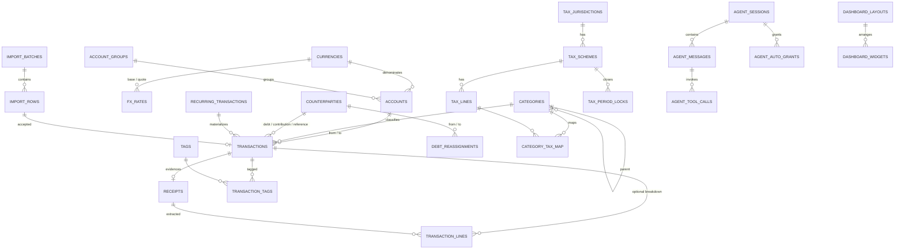
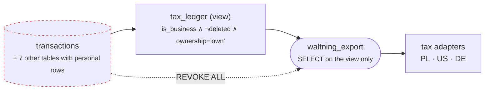

# 3 · Domain model

33 tables, grouped by the aggregate they belong to. Authoritative source is
`packages/db/src/schema.ts`; this explains the shape and the rules the shape
carries.

`SPEC.md` §6 states the entities in prose. What an implementer needs beyond that
is which rules are enforced *where* — because the recurring lesson of
[`../defects.md`](../defects.md) is that this design asserts guarantees, and
asserting is not enforcing.

---

## Aggregates



| Aggregate | Tables | Root |
|---|---|---|
| **Ledger** | `transactions`, `transaction_lines`, `transaction_tags`, `tags`, `receipts` | `transactions` |
| **Structure** | `accounts`, `account_groups`, `categories`, `category_mappings`, `counterparties` | — reference data |
| **Money** | `currencies`, `fx_rates` | `currencies` |
| **Debt** | `debt_reassignments` (+ `counterparty_role` on `transactions`) | `counterparties` |
| **Ingestion** | `import_batches`, `import_rows` | `import_batches` |
| **Schedule** | `recurring_transactions`, `targets` | — |
| **Tax** | `tax_jurisdictions`, `tax_residency`, `tax_schemes`, `tax_lines`, `category_tax_map`, `tax_period_locks`, `ryczalt_rates` | `tax_schemes` |
| **Agent** | `agent_sessions`, `agent_messages`, `agent_tool_calls`, `agent_auto_grants`, `agent_memory` | `agent_sessions` |
| **Presentation** | `dashboard_layouts`, `dashboard_widgets` | `dashboard_layouts` |
| **Audit** | `audit_log` | — append-only |

---

## `transactions` — the four departures worth knowing before writing code

**1 · One transaction per payment event** (§6.10). The unit is the *payment*,
not the thing bought. A card swipe covering petrol and coffee is **one** row with
an optional `transaction_lines` breakdown, not two rows. Cash may legitimately be
either. Any aggregate that sums lines instead of transactions double-counts —
which is why `spend_by_category` is two `UNION ALL` branches, not a `LEFT JOIN`
with `COALESCE` (`computations.md` §6).

**2 · Storage keeps every amount positive; `type` carries direction.** Signing is
a function, not a column:

```
signed(t,'from') = −amount_original   for expense, and the source leg of a transfer
                   +amount_original   for income and adjustment
signed(t,'to')   = +to_amount         destination leg of a transfer only
```

**3 · A transfer is one row with two legs**, each with its own currency, rate and
pivot value. `amount_pivot` and `to_amount_pivot` are **generated columns** —
`amount × rate`, computed by Postgres, so they cannot drift from their inputs.
`fx_rate` has deliberately **no default**: a forgotten rate must be a `NOT NULL`
violation, not a silent `1.0`.

**4 · Debt is the negation of cash flow.** `counterparty_role ∈ {debt,
contribution, reference}` and `debtDelta(tx, side) = −signed(tx, side)`. The
`side` argument is required and is frequently `'to'` — a repayment arrives as a
transfer *into* your bank, whose counterparty sits on the destination leg.
Defaulting it to `'from'` inverted every such balance (C15).

---

## Where each rule is enforced

The column that matters most in this table is the last one.

| Rule | Mechanism | Migration |
|---|---|---|
| `amount_pivot = amount × rate` | Generated column | `0000` |
| Exactly one pivot currency | Partial unique index **+ deferred constraint trigger** — an index bounds a count above, never below, so clearing `is_pivot` used to succeed (C9) | `0002` |
| Transaction currency = account currency | Trigger on `transactions` **and** on `accounts` — an `UPDATE accounts SET currency` walked past a trigger that only watched `transactions` (C2) | `0003` |
| Leaf-only category assignment | Trigger (`TAXONOMY.md` R1) | `0003` |
| Business money never in a shared account | Trigger on both tables, **plus** the target-side guard for a transfer *into* a shared account | `0003` |
| Closed period is frozen | `assert_period_not_closed` on INSERT/UPDATE/DELETE, checking **both** dates on an update | `0004`, fixed `0006` |
| Agent memory holds no figures | `CHECK (body !~ '[0-9]{2,}')` | `0004` |
| Tax view excludes personal rows | View predicate `is_business ∧ ¬deleted ∧ ownership='own'` + role privileges | `0005` |
| Reassignment does not move net receivables | `debt_reassignment_effects` view, summed per currency | `0007` |
| Idempotent re-import / offline replay | Partial unique indexes on `external_id WHERE external_id IS NOT NULL` | `0000` |

**Two of these were defects in the fix itself**, found by executing the trigger
rather than reading it: `RETURN NEW` in a `BEFORE DELETE` trigger returns NULL
and silently cancelled *every* delete (C16), and `coalesce(NEW.date, OLD.date)`
is always `NEW.date` on an UPDATE, so a filed row could be moved *out* of a
closed period and reduce a filed total with nothing inserted, deleted or edited
inside it (C17). Test triggers by running them.

---

## T1 — the tax isolation guarantee



`tax_ledger` appeared in the repository's SQL exactly once — in a comment —
until migration `0005`. Three details an implementer must not simplify:

1. **The `ownership` join is load-bearing.** S16 makes `own → shared`
   retroactive over 498 rows, and a trigger on `transactions` does not fire on an
   `accounts` update. Without the join, business rows sit in a now-shared account
   and stay visible to every adapter.
2. **The denials are enumerated**, not implied. Personal rows also live in
   `receipts.ocr_json`, `import_rows.raw`, `agent_tool_calls.output`,
   `agent_memory` and `transaction_lines`. `ALTER DEFAULT PRIVILEGES … REVOKE`
   keeps anything added later out by default.
3. **The check must be falsifiable.** *"`tax_ledger` contains zero rows with
   `is_business = false`"* restates the view's own `WHERE` and cannot fail.
   `verify_t1()` asserts three things that can: the view definition still filters
   all three predicates, the export role gets `42501` on `transactions`, and the
   two counts agree computed from both sides.

**And the risk runs the other way under ryczałt.** Only revenue is reportable, so
the material failure is a revenue row *never marked business* and therefore
silently absent — under-declared revenue. `is_business` defaults false and the
migration sets it nowhere, so this is the day-one state, not an unlucky one.
`verify_no_omitted_revenue()` is the only check in the system looking in that
direction.

---

## Soft deletion, and the trap in it

`deleted_at` on `transactions`; nothing is hard-deleted. **Every index used by an
aggregate must carry `WHERE deleted_at IS NULL`**, or no aggregate can be
index-only and the dashboard costs ~300 ms cold — which is exactly when you open
it. Every partial unique index must include the predicate too, or a soft-deleted
row keeps its `external_id` reserved and re-import fails.

---

## What has no schema, deliberately

`computations.md` §15 lists figures with no definition and states why. The
important instance: **there is no reporting currency.** USD is the *pivot*, used
only to store rates; display currency is a client preference applied at render
(§7.0). There is deliberately no constraint on a reporting currency because there
is no such thing — a `DualTotal` is scope-invariant for this reason.
