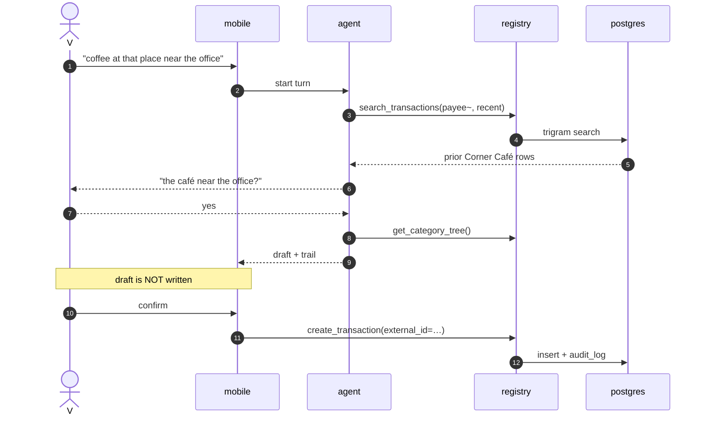
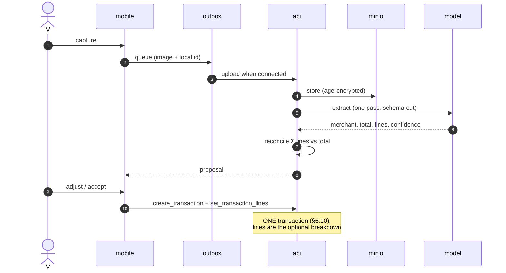
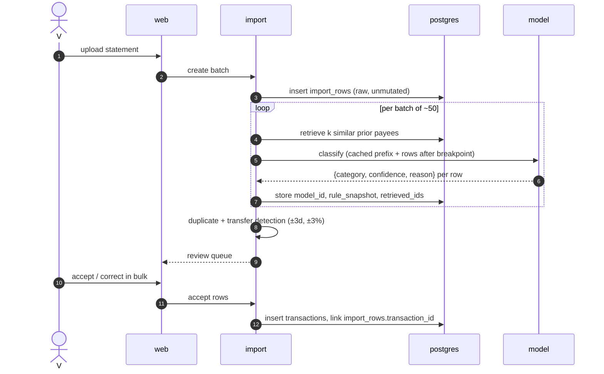
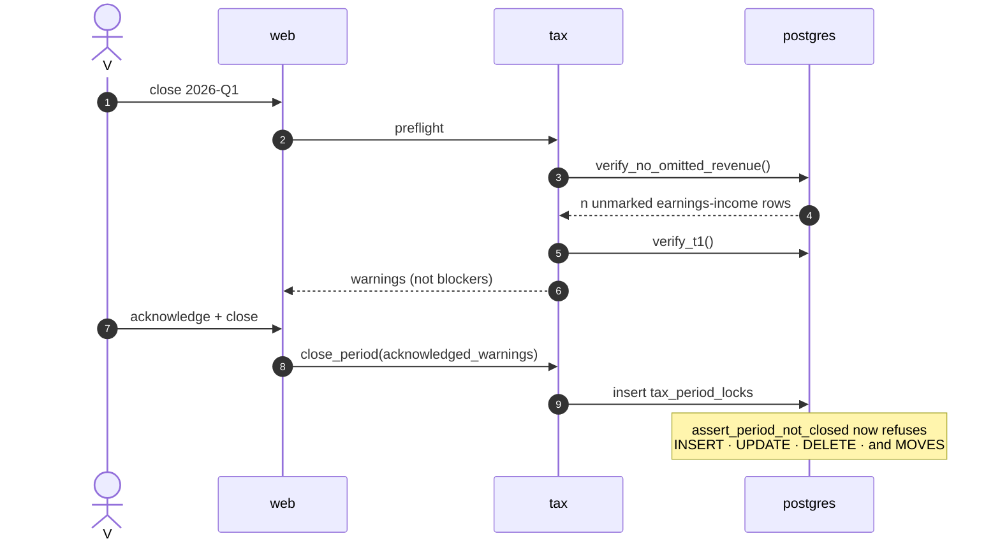
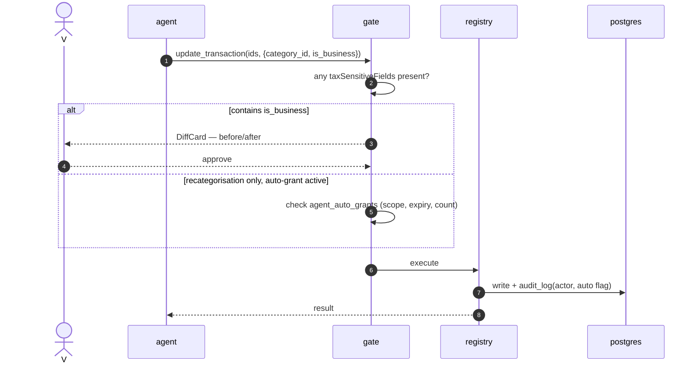
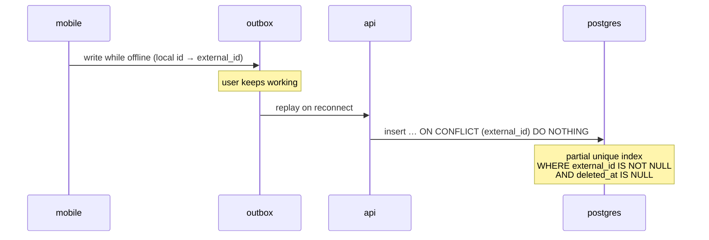

# 4 · Sequences

The five interactions where getting the order wrong produces a wrong number
rather than a bad experience. Everything else is CRUD through the registry.

---

## 1 · Quick add, conversational (S05 `💬`) — the loop

**The draft is never a write.** The loop uses **read tools only**; the single
write happens on confirm, through the ordinary registry entry with an
`external_id` so an offline replay cannot double-post.

This is a loop because you are present and the interaction *is* the iteration.
The same task in bulk is a pipeline — see §3.

---

## 2 · Receipt → lines (§10) — pipeline, refinable

**One payment event, one transaction.** A receipt with fourteen lines is one row
plus fourteen `transaction_lines` — never fourteen transactions. `Σ lines` is
reconciled against the stated total and a mismatch is surfaced, not silently
apportioned.

Refinable, not a loop: a second pass re-extracts with your correction as context.
Each pass is reproducible on its own inputs.

---

## 3 · Statement import (§9) — the deterministic pipeline

**No tool loop in the import path.** One call per batch, stable cached prefix,
retrieved context, structured output. That is what makes the tier scoreable
against 300 fixture rows — a number you can watch move when you change a model.

**`import_rows.raw` is never mutated**, so a reparse is always possible; the
provenance columns are what make the earlier answer explainable rather than
merely repeatable.

---

## 4 · Closing a tax period (J11) — where the freeze starts

**The lock is append-only.** Reopening writes `reopened_at`; a close-reopen-reclose
cycle must not overwrite the first close, because reopening is audited and a
mutable column stores a state rather than a history. One row **per scheme** — a
period spanning a scheme change is normal (J11) and a single `scheme_id` cannot
represent it.

**Warnings are acknowledged, not resolved.** They are stored on the lock, so a
later reader can see what was known to be incomplete at the time. A lock that
implies "clean" would be a lie the first time you close a period with a missing
receipt.

---

## 5 · An agent write — the gate

**The grant is stored, not just its consequences.** `agent_auto_grants` records
what was permitted and until when. Without it, scope and duration are enforced
only by whatever the running process happens to remember — which is not a
property you want on the one feature that bypasses approval.

**Declining returns a result, not an error.** The loop continues normally; a
refusal is an outcome the model can respond to, not an exception that breaks the
turn.

---

## Offline replay — the cross-cutting one

**Every write operation must be idempotent under replay.** This is not a mobile
concern that the API can ignore — it is a constraint on the registry. Two
specifics that have already bitten: `onConflictDoUpdate` against a *partial*
index raises `42P10` unless the conflict target repeats the predicate; and a
partial unique index that omits `deleted_at IS NULL` keeps a soft-deleted row's
`external_id` reserved forever, so re-import silently drops rows.
