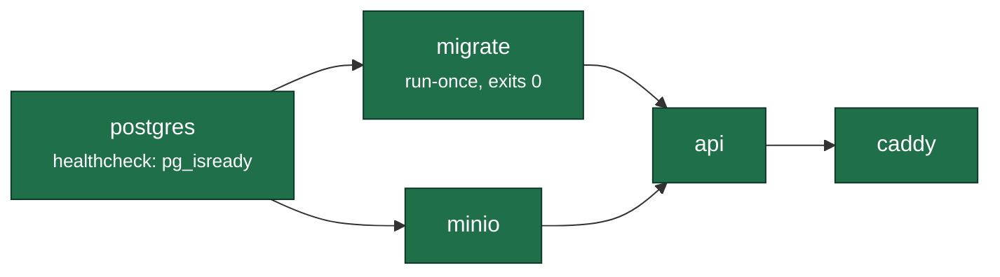
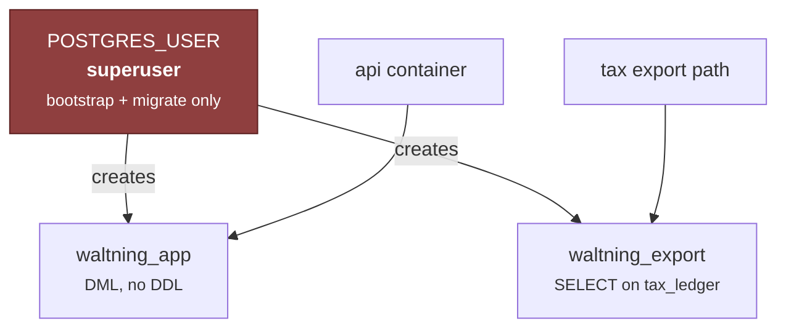

# 5 · Deployment

`SPEC.md` §5 specifies the *policy* — Tailscale-only, Argon2id, TOTP, nightly
`pg_dump`, quarterly restore drill. This is the plan that makes it operable:
what runs where, in what order, and what to do when it breaks.

**Target:** one Raspberry Pi 4 (4 GB), booting from SSD, on a home network,
reachable only over Tailscale.

---

## Environments

| | Purpose | Data | Perimeter |
|---|---|---|---|
| **dev** | Local development | **Real, from day one** — see below | Tailscale bind from the start |
| **prod** | The Pi | Real | Tailscale + auth + non-superuser role |
| **scratch** | Migration rehearsal, restore drills | Throwaway copies | Local only, dropped after |

**There is no "dev has fake data" phase, and that is the whole reason Phase 0.5
exists.** Migration runs in week 0, so five years of real financial history is on
the development machine from the first week. The original plan scheduled
Tailscale for week 15. Bind to the tailnet interface before the importer runs —
half a day, and the alternative is a laptop on a café network one
`docker compose up` away from binding `0.0.0.0`.

---

## Boot order

**`migrate` is a separate one-shot service, not an API startup step.** Two
reasons that matter here: a failed migration must stop the deploy rather than
leave an API serving a half-migrated schema, and migrations `0003`–`0007` create
triggers, views, roles and grants — so the API's own role does not have (and
should not have) the privileges to apply them.

### The `db:push` prohibition

`drizzle-kit push` was removed from `package.json` and must not come back. It
cannot see triggers, views, grants or generated columns — which, after `0003`
through `0007`, is most of what this schema's guarantees consist of. A push that
silently drops `assert_period_not_closed` leaves a database that looks correct
and enforces nothing.

Migrations `0002`–`0007` are **hand-written**. `drizzle-kit generate` needs a TTY
for its rename prompts and would need a snapshot rebuild to resume; the journal
is maintained by hand. Applying them is `drizzle-kit migrate` or `psql` in order.

---

## Roles and secrets

**The API must never connect as `POSTGRES_USER`.** A superuser bypasses every
`GRANT`, so T1 is unenforceable until this is true — and `createDb()`'s default
argument silently supplies it. Make the connection an explicit parameter with no
default, so the mistake is a type error rather than a quiet success.

**Roles are cluster-wide and `pg_dump` does not carry them.** After any restore
into a fresh cluster, `0005` must be re-applied. `verify_t1()` is what detects
that it was not — run it as a post-restore assertion, not as an afterthought.

| Secret | Lives | Never |
|---|---|---|
| Model provider key(s) | Pi environment, injected by Compose | App bundle, git, or a prompt |
| Postgres password | Docker secret / `.env` (0600, gitignored) | Committed |
| Session signing key | Generated first boot, persisted to a mounted volume | Hard-coded |
| Backup encryption key | `age` key on a hardware token + paper copy off-site | On the Pi alone |

All model calls originate from `api`. **The phone never holds a provider key.**

---

## Backup and restore

| What | Cadence | Where |
|---|---|---|
| `pg_dump --format=custom` | Nightly | Local volume → age-encrypted → Backblaze B2 |
| Receipt images | On write | age-encrypted **then** mirrored to the same bucket |
| Retention | 30 daily · 12 monthly · 3 yearly | — |
| **Restore drill** | **Quarterly**, to a scratch container | — |

### Restore runbook

1. Fresh Postgres 16, matching ICU locale settings — `--locale-provider=icu
   --icu-locale=und-x-icu`. A different collation changes `ORDER BY` and breaks
   trigram search behaviour.
2. `pg_restore` the newest verified dump.
3. **Re-apply `0005`** — roles and grants are not in the dump.
4. Run `verify_t1()` and `verify_no_omitted_revenue()`. Both must return true
   before the API is pointed at the restored database.
5. Run the §15.1 invariant set and record the result.
6. Spot-check one balance against a bank statement
   (`tools/migrate-mm/reconcile_bank.py`).

**Steps 3–4 are the ones a drill exists to catch.** A dump that restores cleanly
and silently loses the tax isolation role is the failure this design is most
exposed to, precisely because nothing about it looks wrong.

### An untested backup is not a backup

The drill is quarterly and belongs in the calendar, not in intent. Boot from SSD,
never an SD card — SD cards fail under database write patterns, and they fail
silently for a while first.

---

## Cutover (J15)

**Parallel run before read-only.** The migration's fidelity is checkable; its
*completeness* is a property of the source, and 169 of 246 real transactions on
`Bank A · PLN` are not in Money Manager at all (C19). The parallel period is when
that becomes visible in daily use rather than in a report.

**The sync tooling is permanent, not a migration step.** That the ledger is
partial is an ongoing property of how it was kept, not a cutover event.

---

## Operational monitoring

There is no observability stack, and there should not be one for a single-user
system on one Pi. What replaces it is **S30**, which surfaces the four things
whose silent failure would be expensive:

| Signal | Silent failure looks like |
|---|---|
| Backup status + last successful offsite push | Backups stopped three weeks ago |
| FX coverage per active currency | GEL at 0.5% coverage — went unnoticed for months |
| §15.1 invariant results | A trigger was dropped by a restore |
| Model spend per surface | A loop retrying against a paid endpoint |

**A violation is a defect report, not an exception.** Each writes an `audit_log`
entry with `actor = 'system'` and surfaces on S30; none block a write, because a
check that can halt the ledger is a new failure mode.

---

## Resource budget — Pi 4, 4 GB

| Container | Memory | Notes |
|---|---|---|
| `postgres` | ~1.5 GB | `shared_buffers` 512 MB; the working set is small but the aggregates are index-dependent |
| `api` | ~400 MB | Single Node process |
| `minio` | ~200 MB | Blob throughput is trivial |
| `caddy` | ~50 MB | |
| Headroom | ~1.5 GB | Page cache — this is what keeps the dashboard warm |

**Every ledger index must carry `WHERE deleted_at IS NULL`.** Without it no
aggregate can be index-only, and the dashboard costs ~300 ms cold after any
memory-pressure event — which is exactly when you open it. Budgets in
[`06-quality-attributes.md`](06-quality-attributes.md).
