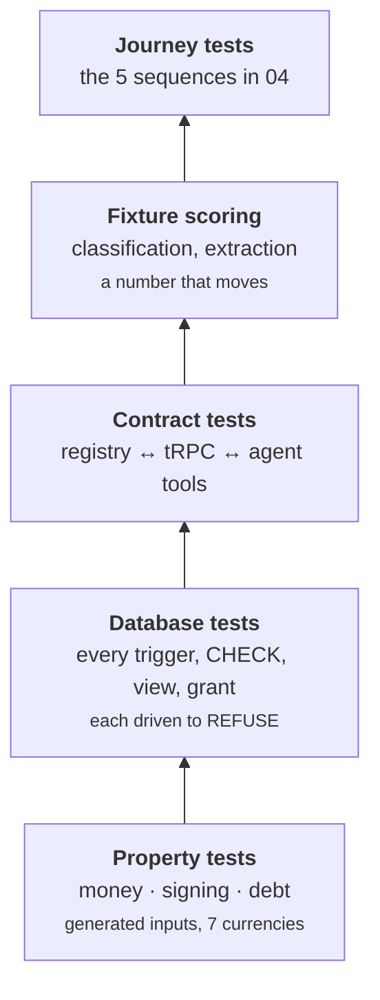

# 7 · Test strategy

What to test, at which layer, and — more usefully — what this project has
already learned about tests that do not work.

---

## The lesson the defect register actually taught

Twenty C-class defects — and 31 H and 24 M behind them — and the pattern in
almost all of them is one thing:
**a guarantee was asserted and never executed.** Two of them were defects *in the
fix for another defect*, found only by running the trigger:

- `RETURN NEW` in a `BEFORE DELETE` trigger returns NULL, which cancels the
  operation — so every `DELETE` on `transactions` was silently suppressed, in
  open periods as much as closed, and Postgres reported `DELETE 0` as ordinary
  success (C16).
- The period guard checked `coalesce(NEW.date, OLD.date)`, always `NEW.date` on
  an UPDATE, so a filed row could be **moved out** of a closed period and reduce
  a filed total with nothing inserted, deleted or edited inside it (C17).

Neither is visible by reading. Both took four statements against a scratch
database. So the first rule of this strategy:

> **A database guarantee is untested until a statement has been refused by it.**

The second, from the same register:

> **An invariant that restates its own implementation cannot fail.** *"`tax_ledger`
> contains zero rows with `is_business = false`"* was true whether or not the view
> existed, the role existed, or something held `SELECT` on the base table. If a
> check cannot be made to return false, it is not a test.

---

## Layers



### 1 · Property tests — money

Generated inputs, not examples. Money is where a bug is both easy to write and
invisible.

- `signed(tx,'from')` and `signed(tx,'to')` sum to the spread on a cross-currency
  transfer, and to zero on a same-currency one.
- `debtDelta(tx, side) = −signed(tx, side)` for all four debt cases (§6.6),
  **on both sides** — a repayment arrives as a transfer whose counterparty sits
  on the `to` leg, and defaulting to `from` inverted every such balance (C15).
- A decimal string round-trips through storage losslessly at scale 8.
- No arithmetic path converts through a JS number.
- Conversion is associative to the pivot: `toPivot` then display equals a direct
  conversion within one minor unit.

### 2 · Database tests — drive each guarantee to refusal

One case per statement against a scratch database, asserting the **resulting
rows**, not merely the absence of an error. `DELETE 0` is a success status.

Required matrix for the period guard, because it is the one with two dates:

| Case | Expect |
|---|---|
| Insert into a closed period | refused |
| Delete a filed row | refused |
| Edit a filed row | refused |
| **Move a filed row out** to an open period | refused |
| **Move an open row in** to a closed period | refused |
| Delete a row in an open period | **succeeds** |
| Insert into an open period | **succeeds** |

The last two exist because C16 made every delete fail silently while every test
about *refusals* still passed.

For T1, the check must be made to fail in each of its three ways:

| Break | Expect |
|---|---|
| `GRANT SELECT ON transactions TO waltning_export` | `export_role_denied_base_table` false |
| Redefine the view without the `ownership` predicate | `view_definition_pinned` false |
| Insert an earnings-income row not marked business | `no_unmarked_revenue` false |

Also required: every migration applies cleanly **from empty**, in order. C1 was a
migration that referenced a table nothing created, so Postgres aborted the file
and all three invariants §6.5 presented as facts had never executed.

### 3 · Contract tests — one registry, two consumers

The registry's value is that the tRPC router and the agent tools cannot drift.
Test that directly:

- Every registry entry appears in the generated router **and** the generated tool
  list.
- Every operation referenced by a screen spec exists in the registry. *(This
  audit is mechanical — running it found `archive_category` missing.)*
- Every write operation accepts an `external_id` and is idempotent when replayed.
- Every operation with `taxSensitiveFields` gates per field even under an active
  auto-grant.
- Every write emits an `audit_log` row with an actor.

### 4 · Fixture scoring — the model surfaces

Not pass/fail. A number you watch move when you change a model or a prompt.

| Surface | Corpus | Metric |
|---|---|---|
| Classification | 300 real statement rows, hand-labelled, **trilingual** | Top-1 accuracy; accuracy on rows with no matching rule |
| Receipt extraction | ~50 receipts incl. crumpled, PLN/GEL, non-Latin | Total match rate; line-count match |
| Duplicate detection | Known duplicate pairs + known near-misses | Precision **and** recall — a false positive hides a real transaction |
| Voice | ~40 utterances, three languages | Intent + amount + account correct |

**This is why the import path is a pipeline.** A loop gives you an outcome
without a trajectory and cannot be scored against fixtures.

Fixtures must include the trilingual tail. English, Polish and Russian appear in
the same account and often the same month — that is most of the tail, not an edge
case.

### 5 · Journey tests

The five sequences in [`04-sequences.md`](04-sequences.md), end to end, plus the
offline replay: write offline, replay **twice**, assert one row.

---

## Migration testing

Migration correctness is not unit-testable, because the oracle is outside the
system. Three checks, and they measure different things:

| Check | Answers | Needs |
|---|---|---|
| `probe.py` | Are the extractor's silent assumptions true? | The `.mmbak` — ✅ run, Reading A confirmed at 100% |
| §8.4 gate | Does our reading match what Money Manager shows? | 52 balances typed off the UI |
| `reconcile_bank.py` | Does Money Manager match **reality**? | Bank `.xls` — ✅ run |

**These are not redundant, and conflating them was C19.** The first two derive
both sides from the same file and can only measure *fidelity*. The bank statement
is the only external oracle, and it showed 169 of 246 real transactions on
`Bank A · PLN` are absent from Money Manager. The ledger is faithful **and partial**;
no balance check can see that.

---

## What is not tested, deliberately

- **Model output determinism.** Not claimed — see `02-components.md`.
- **UI snapshot tests.** Thirty screens against a design system that is still
  moving; snapshots would encode churn as failure.
- **Load and stress.** 25 000 rows on one Pi for one user.
- **Anything that only re-asserts a generated column.** `amount_pivot = amount ×
  rate` is free. It appears in the §15.1 invariant list with its cost stated as
  free, so that its *absence* from the failure list is deliberate rather than an
  oversight.

---

## CI

There is no CI (§4.3 — four packages, one developer). The equivalent is a
pre-cutover checklist that must pass on the Pi:

```
pnpm -r typecheck
pnpm -r test                          # properties, contracts, database
psql -f drizzle/*.sql  → fresh db     # every migration, from empty
SELECT * FROM verify_t1();            # three trues
SELECT * FROM verify_no_omitted_revenue();
node scripts/invariants.ts            # §15.1, against the live database
```

Invariants run **against the live database on a schedule**, not only against
fixtures — the failures that matter are drift, restores that lost a role, and
data that arrived through a path nobody tested.
