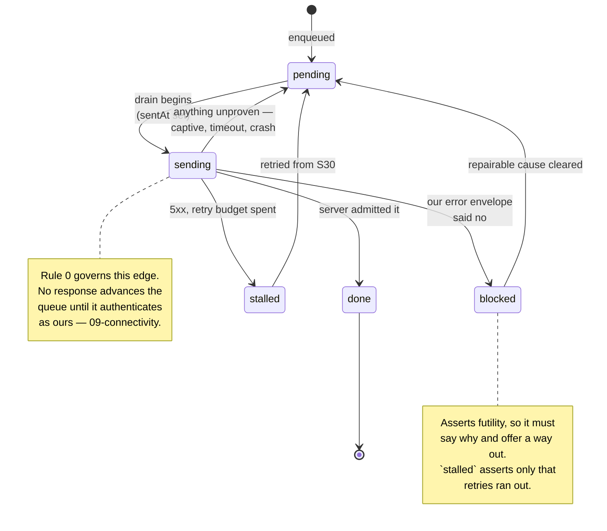

# 8 · Offline, the outbox, and concurrency

Eight defects in [`../defects.md`](../defects.md) — H7, H9, H10, H12, H13, H14,
H15, H16 — are the same gap seen from eight angles. `SPEC.md` §11 settles the
*policy* in one line: single user, two devices, an outbox rather than CRDTs,
with **conflicts resolved by version, never by a clock** (§14.2). What it never
settles is what an outbox entry *is*, and every one of those defects lives in
that space.

This closes it.

---

## Two rules the rest follows from

> **1 · The phone is not an authoritative writer. The backend admits every
> write.**
>
> **2 · An outbox entry is one user intention, not one row change.**

The first bounds the problem before the second solves it. It is also
vindicated, not merely retained: [`14-local-first.md`](14-local-first.md)
drew the line this whole document sits on one side of — **complete is not
authoritative** — and settled that the phone stays on the "not authoritative"
side permanently. What changed is the other half: the phone holds the
**whole ledger**, not a window of it. Nothing below reduces write admission —
that is still Postgres, still one-way intent through the outbox — but reads
no longer wait on the network to be complete.

Every guarantee in §6.5 is a Postgres mechanism — cross-table triggers, `CHECK`s,
an `EXCLUDE` constraint, generated columns, role privileges. SQLite has no
equivalent, so an authoritative phone would either reimplement them (this
register's own thesis, in a new place) or be quietly weaker and accept rows the
server later refuses. And a sync-time refusal after days of authoritative
operation has no clean recovery: the balances shown for those days were wrong,
and you cannot un-show a number someone acted on.

**An earlier draft of this document over-reached from that, to "the phone never
computes a derived figure."** That was wrong, and an eight-way review overturned
it. Write *admission* needs `EXCLUDE` and triggers; `SUM(-amount_original)` over
rows the phone already holds needs neither. The draft also broke its own rule two
paragraphs later, with a balance formula that is plainly a computation.

Every figure in `computations.md` carries a class — foldable,
replica-computable, or server-only. `SPEC.md` §14.3 holds the definitions, and
`14-local-first.md` is why the first two classes cover more than they used to:
the replica is not a partial window a checkpoint used to fill in behind, it is
the whole ledger, so a plain sum over it is enough on its own. The phone may
fold its own unacknowledged outbox entries on top of that sum — a
server-issued checkpoint can still speed the fold up, but is no longer what
makes it *possible* — and it may compute over the replica, full stop, with no
partial-range caveat left to state. What the phone may never do is unchanged:
compute a figure with a documented way of being subtly wrong.

**Offline capability is not reduced by any of this.** Everything you do on a
phone works with no network: manual entry, the grammar, transfers, settling a
debt, capturing a receipt, editing what you entered, and reading your history.
What degrades is *quality* — the conversational loop and extraction need a
model — and it degrades down a ladder rather than off a cliff.

Import, migration, bulk review, period close and rerating are backend
operations, reached from the web dashboard. They never enter the outbox, so the
set-based hazards below (H10, H12) largely cannot arise on the phone. Migration
in particular is one-time and the phone has no part in it.

**Connectivity detection is `09-connectivity.md`, and Rule 0 lives there: a 200
is not a success.** No response advances this queue until it authenticates as
ours. A captive portal answering 200 to every POST would otherwise delete a
week of captures while reporting a successful sync.

---

## Applying the second rule

Every defect below is the consequence of letting an entry be a row change
instead. A bulk accept of forty rows is **one** entry. A receipt capture plus its
draft transaction is **one** entry. Approving a day-wide FX fix is one entry that
names the rows it was approved against.

An entry is:

```ts
interface OutboxEntry {
  id: string;              // client-minted UUIDv7 — identity and idempotency key
  seq: number;             // AUTOINCREMENT — this, and only this, carries ORDER
  op: string;              // registry operation name
  opVersion: number;       // payload shape version — see "Surviving an app update"
  payload: string;         // opaque JSON. The outbox table never changes with the domain
  deps: string[];          // derived automatically at enqueue, not hand-maintained
  capturedAt: string;      // client clock — DISPLAY ONLY, never load-bearing
  capturedTz: string;      // IANA zone, for the date-drift check (§14.3)
  capturedOffsetMinutes: number;
  state: 'pending' | 'sending' | 'blocked' | 'stalled';
  blockedKind?: 'terminal' | 'repairable';
  blockedReason?: string;
  attempts: number;
  sentAt?: string;         // set on transition to `sending`, for crash recovery
  lastError?: string;
}
```

And it moves like this:



**The transition that is absent is the specification.** There is no edge from
`sending` to `done` on an unauthenticated response, and that single missing
arrow is what stops a captive portal deleting a week of captures while
reporting a successful sync.

### Idempotency is a server-side ledger, not an index

The earlier draft grounded its whole idempotency claim in the partial unique
index on `external_id`. **That index exists on four tables and only fires on
INSERT.** Every `update_*`, `delete_*`, `categorize_batch`, `attach_receipt` and
`merge_counterparties` queued to the outbox had no replay protection at all.

The failure is not theoretical and it is nasty. Edit a synced row's
`is_business` offline. The drain commits; the connection drops before the 200
arrives; the entry retries. It carries the `version` it was minted with —
which its own first application already advanced. `is_business` is
`tax_sensitive`, so H16 blocks rather than overwrites. **The entry is permanently
blocked by a conflict with itself**, and S30 reports that another device changed
the field. Nothing did.

Worse on `settle_debt`: the server derives the residual from live data (H9), so a
replay after a lost response **settles twice** — a wrong number in a debt
balance, arriving through the path the design called safe.

So:

```sql
CREATE TABLE outbox_receipts (
  entry_id      uuid PRIMARY KEY,
  op            text NOT NULL,
  request_hash  text NOT NULL,
  response      jsonb NOT NULL,
  applied_at    timestamptz NOT NULL DEFAULT now()
);
```

Checked **first**, for every write, insert or not, and written **inside the same
transaction as the effects**. A repeated `entry_id` returns the stored response
verbatim without re-evaluating the version check. A repeated id with a *different*
`request_hash` is a genuine violation and blocks.

This is also what makes a timeout safe to retry, and what makes the drain report
stable across retries — which H9 depends on.

`external_id` returns to meaning *"a key from a foreign system"*, which is what
the importer needs it for.

### `seq` carries order; the clock does not

`capturedAt` is a client clock, and clocks go backwards — DST, a westward
flight, an NTP correction after a flat battery. Sorting by it means an edit can
drain before the create it modifies: 404, blocked, and then the create lands with
the *uncorrected* value.

UUIDv7 is worse than it looks here, because it embeds the wall clock and is
sortable, which invites sorting by `id`. A naive implementation after a backward
jump can also **mint a duplicate id** — and that id is the idempotency key, so
one of two genuine captures is silently swallowed as a replay. Use an RFC 9562
monotonic-counter implementation.

**`id` carries identity. `seq` carries order. `capturedAt` is for the human.**

`deps` is **derived at enqueue**, not hand-maintained: scan the payload for any
client-minted id belonging to an entry not yet acknowledged, and add it. H13
argues a dependent is never orphaned because the client mints the id — but that
covers only name collisions. Any other refusal of `create_counterparty` leaves
five transactions pointing at a row that does not exist, and a hand-maintained
dependency list in a queue this varied will be wrong within a month.

### Crash recovery, and the drain's transaction boundaries

iOS force-quit gives **no callback at all**, so an entry interrupted in `sending`
is not an edge case. Without recovery it orphans forever and the pending count
never moves — H15's own complaint, reintroduced.

- **On launch, before anything else:** `UPDATE outbox SET state='pending' WHERE
  state='sending'`. Safe *only* because of the idempotency ledger above.
- **The canonical row first, the entry's removal second — two commits, not
  one.** The rule that reads better is one transaction per entry, opened after
  the response arrives, holding both halves. It is not available: `outbox.db`
  and `replica.db` are separate files in WAL mode, and SQLite is explicit that a
  transaction touching several attached databases is atomic per database and not
  as a set (`14-local-first.md` §14.6 settles the same constraint on the capture
  side). So the ordering has to carry what the transaction was going to.
- **Removing the entry first is the bug** — the one the missing transaction was
  there to prevent. Mark-sent commits, the canonical apply does not, and the row
  stops being provisional while still holding what the phone guessed: the
  server-stamped rate and pivot amounts (§14.3) never land, nothing marks the
  row, and no reconciler can find it, because the entry that named it is gone.
  Applying the canonical row first fails the other way, which is recoverable —
  the entry stays in `sending`, the line above returns it to `pending`, the
  resend meets the idempotency ledger and gets the same canonical row back, and
  the apply, an upsert on a client-minted id (H13), is the same write twice.
- **The order is the opposite of the capture path's, and one rule produces
  both:** whichever half commits second must be the half a replay can
  reconstruct. At capture only the outbox holds unsent intent, so it goes first.
  At drain the server already holds the write and the entry is still in the
  queue, so the removal goes last.
- **Never hold one transaction across N network calls.** That holds a write lock
  across I/O, and a kill rolls back sends the server already committed.
- **Receipt file deletion is a third step**, after that transaction commits.

### `blocked` is not always terminal

`blocked` means *retrying will not help*. Two common causes are repairable:

| Kind | Cause | Behaviour |
|---|---|---|
| `repairable: period` | Dated inside a period closed while you were offline | **Auto-requeues when the period is reopened** |
| `repairable: recompress` | Receipt image too large | Recompresses once, retries |
| `terminal` | Validation, malformed input, deleted target | Editable or discardable on S30 |

`stalled` is separate: a 5xx that exhausted its retry budget. Visible, and
distinct from both `blocked` (which asserts futility) and silent infinite retry.

### Surviving an app update

Nothing previously specified the client's own schema version, and the default
shortcut — drop the database on mismatch — destroys the one thing in the system
that exists nowhere else.

The subtler failure is worse. An entry's payload is *"validated against the same
Zod schema as online"*. Ship v2 with a changed schema for `create_transaction`
and every v1 payload fails validation on drain. That is 4xx. Under the rule
above, 4xx is `blocked` and never retried. **A week of offline captures goes
permanently blocked in one batch — correctly, by the rules as written.**

The event-sourcing pattern is the right one, because the payload *is* a recorded
intention:

1. **Two independent version counters, and neither one drops the file it
   counts.** `PRAGMA user_version` for the replica migrates it **in place** —
   one version per generated migration file (`packages/ledger/tools/embed-ddl.ts`),
   applied in filename order, each version's statements run in one
   transaction after a pre-migration copy. **A version names a file, not a
   position**: it is the file's own four-digit prefix plus one, so
   `user_version = 7` means "`0006_schema` has run" on every build that ever
   ships, and a chain that later gains, renumbers or drops a file does not
   silently redefine what an installed database's number meant. A step that
   cannot be expressed in SQL alone carries a hand-written **backfill**,
   registered under that same filename: a `fill` that runs inside the
   migration transaction immediately after its own step's statements, and
   optionally a `check` that runs **before the pre-migration copy is taken**,
   so a migration that cannot succeed against a particular database refuses
   while that file is still untouched and gives the same reason on every
   launch after. Because a step may rebuild a table, the whole migration runs
   with foreign keys off; `PRAGMA foreign_key_check` inside the same
   transaction, before the version moves, is what pays for the enforcement
   given up — an orphan rolls the migration back rather than committing. The
   replica is now
   the whole ledger, not a window (`14-local-first.md`), so it is never a
   database this module drops to recover a version mismatch — the outbox
   below never was, for the same reason, and now neither is the replica. A
   **refetch from a backend** — rebuilding the replica from what a server
   holds — is a *separate* operation belonging to sync (arc 2), triggered by
   sync's own decisions (an epoch mismatch, an explicit reset a person asked
   for), never by a schema version. A separate, forward-only,
   never-destructive chain for the outbox, same rule.
2. **The outbox table's shape never changes with the domain.** The payload is
   opaque to it, so domain changes change *payloads*, not tables.
3. **Upcasters, not migrations.** Pure functions `upcast(op, v, payload)` chained
   from every historical version to current, applied **at drain time**. Tested
   with golden fixtures of every historical shape — those fixtures are what stops
   this recurring.
4. **The server accepts N−2 op versions.** A phone can be offline across two
   releases, or simply not updated.
5. **Never drop.** No upcaster means `blocked(unsupported_version)`, surfaced on
   S30 with the raw payload readable and exportable, so a lost intention can be
   re-entered by hand rather than vanishing.
6. **Migrate in one transaction, bumping the version inside it.** Migrations run
   at launch, which is when iOS is most likely to kill the app.

---

## H7 · A receipt and its draft are one intention

**The defect.** You save a transaction, then the queued image drains separately
and creates a second row for the same payment — violating §6.10 directly. The
client-UUID defence does not help, because these are two genuinely distinct
client operations.

**Decided.** The draft mints the transaction id **before** the image is queued,
and the upload entry carries it as `deps` and as its `transaction_id`. The image
attaches to a row that already exists, or waits. It never creates one.

If the transaction entry is later discarded — you cancelled the draft — the
dependent upload is discarded with it. An orphaned image is a storage cost; an
orphaned *transaction* is a wrong number.

---

## H9 · A residual computed from a stale minuend

**The defect.** S14 renders the settle sheet from cache while offline and
computes the residual — the screen's own stated safety mechanism — against a
balance that may have moved. Same shape on the unsettled banner, where a second
allocation drives a clearing account negative.

**Decided: the client's residual is an estimate and is labelled as one; the
server recomputes on commit.**

- Offline, the sheet shows `as of 14:20` beside the balance. Not a warning
  banner — a timestamp, because the number is usually right and a banner that
  cries wolf gets dismissed.
- `settle_debt` takes the **amount being settled**, never the residual. The
  server derives the residual from live data.
- If the live residual differs from the client's stated one, the entry does not
  fail. It applies the settlement and surfaces the corrected residual in the
  drain report — because the money genuinely moved, and refusing to record it
  because a *display* was stale is the worse error.

**A settlement never implicitly clears a balance** (§6.6). That rule is what
makes this safe: the remainder is always stated, so a stale minuend produces a
wrong *expectation*, never a wrong ledger.

---

## H10 · Set-based writes freeze their set at approval

**The defect.** S09's day-wide FX fix says "and 4 other rows" at approval and
applies to whatever matches at drain — 23 rows if an import landed in between, at
a rate you asserted about one purchase.

**Decided: an approved set is a list of ids, never a predicate.** The operation
input carries the explicit ids the user was shown. Rows that arrived afterwards
are not in it, by construction.

If any id has since changed in a way that affects the operation, those rows are
skipped and named in the drain report. This applies to every set-based
operation — `rerate_transactions`, `categorize_batch`, bulk accept — and it is a
registry-level rule, not a per-screen one: **an operation whose input is a
predicate cannot be approved, because what you approved is not what will run.**

---

## H12 · Bulk accept is one entry, so undo is one removal

**The defect.** Bulk accept is one undoable unit in the UI and N entries in the
outbox. Undo queues compensating writes *behind* the unsent accepts, so a partial
drain commits rows from an operation you explicitly undid.

**Decided.** Bulk accept is a **single** entry containing all N ids. Undo before
it drains removes it from the queue — nothing was sent, so nothing needs
compensating. Undo after it drains queues a genuine compensating entry, which is
correct because the write really happened.

This is the rule at the top doing its work: N entries was the bug.

---

## H13 · Client ids are the identity; names are display

**The defect.** An offline `create_counterparty` collides on a unique name, the
server rejects it, and five transactions reference an id that does not exist.
Ordering was preserved and ordering was not the problem.

**Decided.** The client mints the entity id. Dependents reference it, and the
server accepts that id as given — so a dependent is never orphaned by a
name collision.

A name collision is then not an error at all but a **merge decision**: the entity
is created with the client's id and a disambiguated name, and surfaces on S15 as
a merge candidate against the existing one. That reuses machinery already
specified — S15's merge is reversible indefinitely and archives rather than
deletes — instead of inventing a failure path.

This is exactly why `accounts_name_uq` is on `lower(btrim(name))` and the primary
key is a UUID: **names are display, identity is the id** (§6.1).

---

## H14 · Duplicate detection runs at drain, not only at import

**The defect.** A capture queued on a phone is invisible to the import's
duplicate detection, which claims to run against "the whole ledger" — a ledger
missing the other writer.

**Decided.** Duplicate detection is a **server-side check on commit**, for every
path, not a step inside the import pipeline. Import calls it; so do
`create_transaction` and the outbox drain.

The window and tolerance are already defined once (`computations.md` §9: ±3 days,
±3% cross-currency), so this is a relocation, not a new rule. A drained capture
that matches an imported row surfaces as a duplicate to resolve with the three
actions S02 defines — **separate, skip, supersede** — rather than landing
silently.

**It cannot block the write.** A queued capture that turns out to be a duplicate
is flagged, not refused; refusing would lose data captured in good faith.

---

## H15 · A blocked outbox is a state, and it is visible

**The defect.** A constraint violation on drain wedges the queue forever, with no
`outbox blocked` state anywhere in the state matrix. The user sees pending
markers that never clear, indistinguishable from a slow network.

**Decided.** Three states, and the third is new:

| State | Meaning | Surface |
|---|---|---|
| `pending` | Waiting for connectivity | The ordinary dot |
| `sending` | In flight | — |
| `blocked` | The server refused it, and retrying will not help | **Banner + S30 count + the row itself marked** |

A `4xx`-class refusal — a constraint violation, a closed period, a validation
error — moves the entry to `blocked` immediately rather than retrying. Retries
are for transport failures only. `5xx` and network errors back off and retry.

**A blocked entry does not block the queue.** Entries behind it drain, unless
they list it in `deps`. This is the difference between one bad row and a wedged
device.

The entry is inspectable, editable and discardable from S30 — which is the
screen `06-quality-attributes.md` names as the operational surface, and this is
its fourth silent failure made loud.

---

## H16 · `update_transaction` is a patch, with a version

**The defect.** Undefined as patch-or-replace. If it carries the whole entity, a
phone's category edit reverts a laptop's `is_business` and `ryczalt_rate`, and
the row silently leaves `tax_ledger`.

**Decided: every `update_*` is a patch.** Only the fields present in the input
are written. This is the registry-wide convention, so no operation has to be
inspected to know its semantics.

Patch semantics alone still lose an edit when two devices touch the *same* field,
so the input also carries the `version` the client last read — a `bigint` the
database advances, never a timestamp to rank — **and the prior value of every
field it sets.** The version is only the fast path; it is per row, and the
question is per field, so on its own it reports a laptop's payee fix as a
conflict with a phone's queued category edit (`14-local-first.md` §14.2):

- Same field, different values → a **real conflict**, detected by the version
  the input carries — never a clock race. It follows the conflict setting
  (latest-applied-wins or *ask*, §14.2), and either way the outcome is recorded
  in `audit_log` with both values, so nothing is silently lost.
- Different fields → both land. This is the common case and the one full-entity
  replace got wrong.
- A `tax_sensitive` field with a stale version → **blocked**, not overwritten.
  These are the fields §11.2 already gates per field even under an auto-grant;
  silently losing one is how a filed figure moves.

---

## What is deliberately not built

**No CRDTs, no vector clocks, no operational transform.** One user with two
devices editing the same field within a sync window is rare, and the cost of
being wrong is one audited overwrite. The machinery would exceed the ledger.

**No offline reads of derived tax figures once a backend exists.** They depend
on rates, period locks and residency, all of which the device may hold staler
than it knows. S28 is then online-only, and that is a smaller loss than a tax
figure computed from a stale lock.

**With no backend the phone shows them as labelled estimates**
(`14-local-first.md` §14.1), and that is not a contradiction: the objection
above is *staleness relative to a server*, and with no server there is nothing
to be stale against. The tax tables are server-only, so what the phone computes
is visibly an estimate from what it holds. Filing-grade figures still need the
backend, because T1 is a role grant and a phone has no equivalent.

**~~No conflict resolution UI.~~ Superseded.** This predates the conflict
setting. `14-local-first.md` §14.2 makes a same-field divergence follow a
choice — *latest applied wins* or *ask* — and **the tax-sensitive set always
asks**. *Ask* is a conflict resolution UI; declining to build one would delete
the setting rather than simplify it.

What survives is the sizing argument, and it still binds: this is a screen for
a single user who sees it a few times a year, so it presents **one divergence,
two values, and a choice** — not a merge tool. Different fields on the two
sides still merge with no prompt, and `blocked` still covers what must not
resolve silently.
