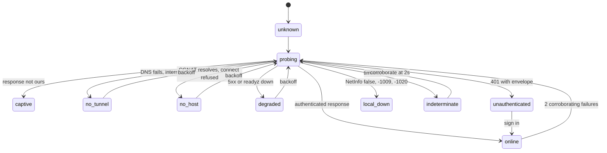

# 9 · Connectivity

`SPEC.md` §14.3 settles what happens offline. This settles **how the app knows**,
which turns out to be the harder half.

The offline design was strong on the data axis and naive on the reachability
axis: "online" appeared as a three-row table and a boolean column in the state
matrix. Behind that boolean sit **four independent failure domains in series** —
radio, IP, WireGuard tunnel, and Pi/Postgres/API/session — and the app can
observe none of them directly.

Worse, the transport this system chose makes the problem sharper. Tailscale-only
ingress (§5.1) with node-key expiry deliberately left **on** means the one layer
whose failure is both scheduled and recurring is completely invisible to every
React Native connectivity API.

---

## `navigator.onLine` is wrong 11 times out of 12

| Real state | NetInfo reports | Right? |
|---|---|---|
| Airplane mode | `isConnected: false` | ✅ the only reliable one |
| Radio, no IP | `true`, then `isInternetReachable: false` | ⚠️ lags 5–30 s |
| **Captive portal** | `true` / **`true`** | ❌ the portal answers the probe |
| Tailscale extension off | `true` / `true` | ❌ |
| **Node key expired** | `true` / `true` | ❌ |
| Another VPN holds iOS's tunnel slot | `true` / `true` | ❌ |
| Network blocks WireGuard and DERP | `true` / `true` | ❌ |
| Pi off, rebooting, or SD card dead | `true` / `true` | ❌ |
| Postgres down | `true` / `true` | ❌ |
| API returning 5xx | `true` / `true` | ❌ |
| Session expired (401) | `true` / `true` | ❌ |
| Cellular denied to this app in Settings | `true` / `true` | ❌ every request fails `-1020` |

**NetInfo is a negative gate only** — *don't bother probing* — never a positive
signal and never a sync trigger.

---

## The `link` state machine

One persisted enum, plus `lastReachedAt` and `lastProbeError`. Cold start is
`unknown`, **never `offline`** — offline is a claim, and you have not earned it
yet.



| State | Signal | Copy | Drain? |
|---|---|---|---|
| `unknown` | Cold start | `12 waiting · last synced 14:20` — no connectivity claim | no |
| `local-down` | NetInfo false · `-1009` · `-1020` | `No network`. For `-1020`: **`Waltning isn't allowed to use cellular data`** + Settings link | no |
| `captive` | Response is not ours (see below) | `This Wi-Fi wants you to sign in` → *Open network login* | **no** |
| `no-tunnel/off` | Internet OK, tailnet DNS fails, no VPN interface | `Tailscale isn't running` → *Open Tailscale* | no |
| `no-tunnel/expired` | Above + `keyExpiresAt` past | **`Your Tailscale key expired on 3 Aug — reconnect in the Tailscale app`** | no |
| `no-tunnel/conflict` | VPN interface present, key valid, tailnet unreachable | `Another VPN is active — iOS allows only one` | no |
| `no-tunnel/blocked` | Tunnel up, all probes time out on a working network | `This network is blocking Tailscale` | no |
| `no-host` | Tailnet name resolves to `100.64.0.0/10`, connect refused | `Your server isn't answering · last reached 14:20` | no |
| `degraded` | 502/503/504, or `/readyz` reports `db: down` | `Server is up but not healthy · retrying` | **no — pause** |
| `unauthenticated` | 401 **with our envelope** | `Sign in to sync · 12 waiting` | pause, resume after auth |
| `online` | One authenticated response with a valid nonce | *(no banner)* `Synced 14:20` | **yes, automatically** |
| `indeterminate` | Timeout `-1001`, `-1005`, or iOS suspended the task | `Checking… · last synced 14:20` — keeps the previous truthful claim | in-flight → `pending` |

**Transitions are deliberately asymmetric:** `online` on **one** success — good
news is cheap and verifiable — but leaving it needs **two corroborating failures
≥2 s apart**, or one unambiguous signal. A single failed request never changes
what the user sees.

---

## Probes

Nothing in the specification defined a health endpoint the *client* could call,
which made three of the states above unreachable by construction.

1. **`GET /healthz`** — unauthenticated, does not touch Postgres. Returns
   `{"ok":true,"build":"<sha>","serverTime":"…"}` with an `x-waltning` header.
   Separates *reachable* from *healthy*.
2. **`GET /readyz`** — authenticated, touches Postgres and MinIO. Separates
   `degraded` from `online`, and lets the client honour the per-dependency
   degradation `01-context-and-containers.md` already promises.
3. **Control probe** — `captive.apple.com/hotspot-detect.html`, byte-exact
   success body. The only way to distinguish *no internet* from *no tunnel*.

**Probe 3 is an explicit exception to "every external arrow is outbound or
manual".** It is a phone→third-party request the L1 context diagram does not
show. It adds no new party to the threat model — iOS itself hits that endpoint —
but it is recorded here rather than smuggled in.

Ship the Pi's tailnet IP alongside its MagicDNS name: name fails but IP connects
means MagicDNS, not the tunnel.

---

## Rule 0 — a 200 is not a success

**This is the most important rule in the document, and its absence was a
data-loss bug.**

A captive portal answers `200` with HTML to every POST. A drain that classifies
on status class alone reads that 200, marks the entries sent, and deletes them.
Nothing reached the Pi. The captures are gone — and §14.3 says in its own words
that losing a capture is the worst outcome in the system. It arrives disguised as
a successful sync, on hotel wifi, which is exactly where a week of travel
captures would be.

So, before status is consulted at all, every response must authenticate as ours:

- an `x-waltning` header,
- a body that parses as the tRPC envelope,
- the per-session nonce issued at login.

Failing any of those ⇒ `link = captive`, **the queue does not advance**, and no
entry changes state, whatever the status code said.

**The nonce is a signal in the *response*, and the client must never send it.**

It is established at login and held by both ends. The API stamps the session's
own nonce as `x-waltning-nonce` on every response, errors included, exactly as
it stamps `x-waltning`; the client compares it against what it was issued.

Putting it in the *request* for the server to echo is the obvious design and it
authenticates nothing. Anything able to answer the request was able to read it,
so a captive portal can echo it back exactly as well as the API can — and the
secret is now transmitted on every call rather than once at login. **A portal
never saw the login**, which is the only reason this check is worth anything.

Stated here because the order of work makes it easy to get wrong twice: the
client half is implemented and tested (`rule-zero-fetch.ts`), fed `null` until
§5.2 exists, so **the first session issued without the server stamping its
nonce would classify every response in the system as captive** — total,
immediate, and looking exactly like a network failure.

**Rule 1:** only errors carrying our envelope may set `blocked`. A bare 403 from
Caddy or a 404 from a proxy is a *transport* event, not a domain refusal.

**The domain code is at `error.data.code`, not `error.code`.** This rule read
`{error:{code,…}}` and the server obliged, putting `validation` or
`period_closed` where tRPC keeps its numeric JSON-RPC code. tRPC's client
validates that field's type and **discards the entire error response** when it
is not a number — so the signal this rule depends on reached no client at all,
and a permanent refusal was indistinguishable from a proxy's 403. See C29. The
envelope is now:

```json
{"error":{"code":-32600,"message":"…","data":{"code":"validation","httpStatus":400,"path":"op.create_counterparty"}}}
```

---

## Status → action

| Status | Cause here | Entry | Queue | `link` |
|---|---|---|---|---|
| 200/201 + envelope | Applied | `sent`, remove | continue | `online` |
| **200, envelope invalid** | **Captive portal** | **unchanged** | **halt** | `captive` |
| Idempotent replay hit | Retry after a lost response | `sent` (stored response) | continue | `online` |
| 400 | Malformed — client bug | `blocked(terminal)` | continue | `online` |
| **401 + envelope** | Session expired (§5.2) | **unchanged** | **pause**, resume after sign-in | `unauthenticated` |
| 401 no envelope | Proxy or gateway | unchanged | pause, backoff | `degraded` |
| 403 + envelope | Domain refusal | `blocked` per code | continue | `online` |
| 403 no envelope | Tailscale ACL or node revoked | unchanged | **halt** | `no-tunnel` |
| 404 + envelope | Target deleted elsewhere | `blocked(terminal)` + discard/repair | continue | `online` |
| 404/405/406/415 no envelope | Version skew | unchanged | halt, version check | `degraded` |
| 408 | Server-side timeout | `pending` | backoff | `indeterminate` |
| 409 same key, same hash | The designed retry path | **success**, stored response | continue | `online` |
| 409 same key, different hash | Genuine idempotency violation | `blocked(terminal)` | continue | `online` |
| 409 stale version, `tax_sensitive` | H16 | `blocked(terminal)`, both values shown | continue | `online` |
| 410 | Hard-deleted target | `blocked(terminal)` | continue | `online` |
| 412/428 | Precondition | refresh, retry once, then `blocked` | continue | `online` |
| 413 | Receipt too large | `blocked(repairable: recompress)`, auto-retry once | continue | `online` |
| 422 | Validation, non-leaf category, currency mismatch | `blocked(terminal)`, **editable on S30** | continue | `online` |
| 423 | Period locked | `blocked(repairable: period)`, **auto-requeues on reopen** | continue | `online` |
| **429** | Rate limit — §5.2's login limiter is the realistic source | `pending` | **pause** for `Retry-After` | `online` |
| 500 | API bug | `pending`, `attempts++` | backoff; after 5 → `stalled` | `degraded` |
| 502/504 | Caddy up, API restarting | **unchanged** — don't burn attempts | **pause whole drain** | `degraded` |
| 503 + `db: down` | Postgres down | unchanged | pause whole drain | `degraded` |
| 507 | **Pi disk full** — realistic on a Pi | unchanged | **halt**, loud S30 banner + push | `degraded` |
| Timeout `-1001` / `-1005` | Outcome unknown | `pending` after grace — **never** `blocked`, **never** `sent` | corroborate ×2 | `indeterminate` |
| `-1003` / `-1006` DNS | Tunnel down | `pending` | halt, backoff | `no-tunnel` |
| `-1004` refused | Pi off, Docker down | `pending` | halt, backoff | `no-host` |
| `-1009` | No internet | `pending` | halt | `local-down` |
| `-1020` | Cellular denied to this app | `pending` | halt | `local-down` + Settings link |
| `-1200` / `-1202` TLS | **Clock skew** on the Pi, or MITM — *not* offline | `pending` | halt | own state, names the cause |

**The two rows that carry the document** are the invalid-envelope 200 (prevents
data loss disguised as success) and the 401-with-envelope (prevents the queue
declaring twenty real captures permanently refused because a cookie aged out).

**`401` and `429` never block, and this is not a detail.** Re-auth needs TOTP,
§5.2 rate-limits the login route, and 429 is also 4xx — so the naive rule has the
queue wedging itself while trying to unwedge itself.

---

## `NSURLError` codes must survive to the classifier

Every discrimination above rests on numeric codes, and **React Native's `fetch`
collapses all of them into `TypeError: Network request failed`.** On RN Web,
`navigator.onLine` gives strictly less.

The probe layer therefore uses `expo/fetch` or a thin native module that surfaces
the code. `design-system/11-platform-notes.md` gains a networking row; it
currently covers fonts, icons and haptics and says nothing about this.

---

## Debounce, backoff, and the train

| Control | Value |
|---|---|
| Probe backoff | 0, 2, 5, 15, 30, 60, 120, 300 s cap, ±20% jitter |
| Reset triggers | Network path change · foreground · user tap · successful drain · push |
| **Banner dwell** | **20 s minimum** before any user-visible connectivity string changes |
| Leaving `online` | 2 consecutive failures ≥2 s apart |
| Entering `online` | 1 success |
| Foreground settle | Wait 1.5 s or one path update before classifying — the Tailscale extension may be re-establishing |
| Drain concurrency | Exactly 1; concurrent requests coalesce |
| Prompts | **0** |

**The train test.** Signal returns for 8 s: probe succeeds → `online` → drain
starts → 3 entries land → signal drops mid-entry-4 → timeout → entry 4 back to
`pending` → `indeterminate` → two corroborating failures → `local-down`. The
banner changed once. Repeat forty times over two hours: forty banner changes at
most, zero modals, zero notifications.

---

## Node key expiry

§5.1 leaves expiry on, forcing periodic re-auth. Nothing specified what the app
does when it fires, and **no iOS API lets a third-party app read Tailscale's node
state**. The failure: the key expires at 03:00, you capture twenty transactions
across the day, every sync silently fails, the app says *showing data as of
yesterday*, and the remedy is in a different app you have no reason to open.

Both halves of the fix already exist in the design:

1. **The server supplies the expiry.** The Pi queries the Tailscale API and
   returns `{ thisDevice: { keyExpiresAt } }` on every successful sync, so the
   app warns **while still connected** — *"Your Tailscale key expires in 6 days"*.
   A mystery outage becomes a scheduled chore.
2. **Push survives tunnel loss.** S30 already establishes an outbound Pi → APNs
   channel with a deliberate three-condition budget. Push reaches the phone with
   no tailnet at all. Add a fourth condition: *a node key expires within 72 h*.
   It is the same rule S30 already states — alert on the symptom, not the event —
   and it is the only way the system can speak to a phone it cannot reach.

**First run needs its own copy.** J01 says setup cannot proceed offline with a
plain retry, which is wrong here: a new device has never connected, so there is
no *last reached* and no replica, and the overwhelmingly likely cause is not
being enrolled in the tailnet. It should say so — *"Waltning can't reach your
server. Is this device connected to Tailscale?"*

---

## Background reconnect is not implementable on iOS, and not dependable on Android

§14.3's earlier wording promised sync "automatic on reconnect". Only the
foreground half is real: iOS gives ~30 s via `beginBackgroundTask`,
`BGAppRefreshTask` runs opportunistically — minutes to never, throttled by usage
patterns, and this app opens a few times a day — and **there is no OS event for
"connectivity returned while suspended"**. The Tailscale extension is itself
subject to memory-pressure termination, so the first request after a foreground
is disproportionately likely to fail, which is what the settle delay above is
for.

**Android gets to the same trigger list along a different road, and the
difference matters when someone later asks why.** A background drain is
genuinely implementable there — `expo-background-task` over `WorkManager`, with a
network-connected constraint — and the custody objection that closes it on iOS
does not exist: §5.7 records that Android's credential-encrypted storage is
readable from first unlock until reboot regardless, so nothing is weakened by
running while locked. What rules it out of the design is **reliability**. The
floor between periodic runs is fifteen minutes, the constraint only promises *a*
network rather than a reachable Pi, Doze and app-standby buckets stretch both,
and OEM vendors kill background work whatever the framework promised. A drain
that happens somewhere between fifteen minutes and never cannot be a mechanism
any state, banner or freshness figure refers to.

Drain triggers are therefore, on both platforms: foreground · in-foreground path
change · user tap · silent push. If background drain ever genuinely matters, the
mechanism is a `content-available` push from the Pi — outbound-only, consistent
with §5.1, and the same channel node-key warnings need. An opportunistic
`WorkManager` drain may exist on Android **as a bonus that nothing above the
transport knows about**: it may advance the queue, and it may never be the reason
a figure is fresh or a banner is absent, because it cannot be relied on to have
run.

**§5.7 owns the reason, and the reason is not the same on both.** On iOS *never
drain while locked* is a custody decision — draining while locked would force the
weakest file-protection class and make every other control in that table theatre.
On Android it is a reliability decision, and the custody question there is
whether the database is encrypted at all, which §5.7 leaves open. If it is
answered yes, the background drain becomes impossible as well as undependable: a
passphrase wrapped by a Keystore key requiring an unlocked device cannot be
unwrapped while the phone is locked. Nothing here loses anything by that,
which is the test of whether the bonus was correctly scoped.
