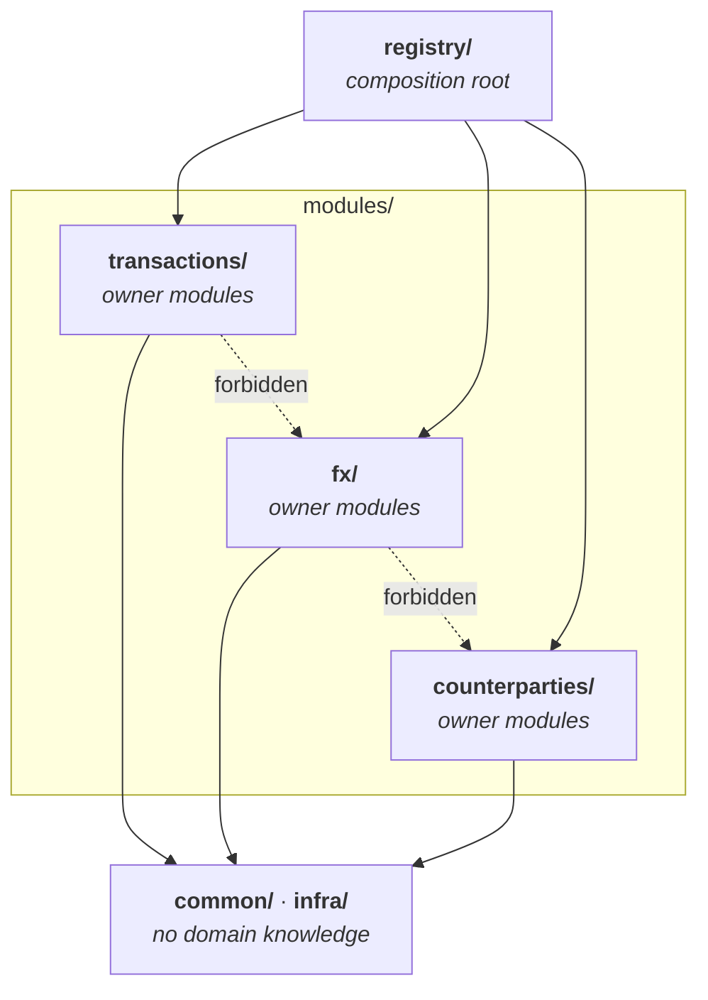
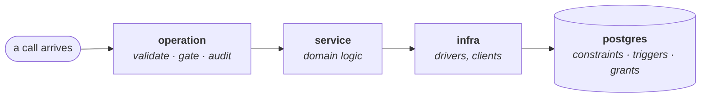

# 10 · Code structure

Where a file goes, and why the answer is never "wherever".

`02-components.md` describes the runtime components. This describes the
**source layout** that produces them — a different question, and one that
becomes expensive to answer late. A hundred files laid flat in `src/` is a
decision too, just an unexamined one.

Two conventions, one per side, chosen because each is the standard vocabulary
in its own ecosystem rather than something invented here.

---

## Modules first, layers inside

**The primary axis is the business domain, not the technical role.** A module
owns its whole vertical slice — declaration, logic, tests — so a change to how
currencies work is one folder rather than three.

```
apps/api/src/
  modules/<domain>/     <op>.operation.ts · <domain>.service.ts · tests
  common/               errors, pagination — no domain knowledge
  infra/                database, blobs, model providers
  registry/             the mechanism, and the composition of module operations
  http/ trpc/ middleware/ config/    composition root

apps/mobile/
  app/                  expo-router entries: compose screens, own navigation
  src/                  platform adapters and platform-resolved screens

packages/
  core/                 contracts (money, operation types, schemas)
  client/               transport, hooks, state and derived models by domain
  ui/                   rendering by domain, plus domain-free foundations
  db/ · schema/ · ledger/  server and phone persistence
```

Only concrete subpaths declared in a package's `exports` map are public. Each
subpath resolves directly to the module that owns its values; barrel files are
forbidden, including package roots. No module or feature imports another.
Composition happens at the registry on the server and in `app/` routes on the
client. Two modules that need each other are usually one module, or want a
third that both depend on. `tests/module-boundaries.test.ts` enforces the
module direction and Biome refuses barrels.

JSX props take named function references. An arrow function, function
expression or `.bind()` inside JSX fails the same Biome gate; ordinary arrows
outside JSX remain legal.



The dotted edges are what the boundary test refuses. They are the edges that
appear first under deadline, and the ones least visible in a diff.

### Layers did not go away

They moved inside the slice. The operation validates, gates and audits; the
service computes; Postgres enforces; `infra/` talks to the outside. What
changed is that a module's three layers sit next to each other instead of being
scattered across three top-level folders that each contain every domain.

| Layer | Does | Never |
|---|---|---|
| operation | Validate, gate, audit, orchestrate | Arithmetic, or a business rule |
| service | Domain logic, one module each | Sees a request, header, or tRPC context |
| infra | Talks to Postgres, MinIO, model providers | Knows what a transaction *means* |



The three layers of the table, in one slice rather than three folders.

**Services compute; Postgres enforces.** Anything phrased as "must never" gets
both — the service check for a good error message, the constraint for when the
service is wrong.

### Atomic design is a scale, not a filing cabinet

`packages/ui` was three global folders — `atoms/`, `molecules/`, `organisms/` —
and that is the standard misreading. Those names answer *how big is this
component* and never *what is it for*, so every feature's pieces end up mixed
together and nothing can be moved, tested, or deleted as a unit.

The tiers belong **inside** a module that owns UI, where they describe
composition within one bounded thing:

```
features/transactions/ui/
  atoms/       only if this feature owns a primitive nothing else needs
  molecules/   TransactionRow, AmountField
  organisms/   TransactionList, CaptureSheet
```

A common module that touches UI has them too — that is what `packages/ui` is,
and it is legitimate there because a design system has no features to slice by.

The design system's own vocabulary maps onto the tiers rather than competing
with it: §3 primitives are atoms, §5 composites split across molecules and
organisms, and screens stay screens.

**A component reaches shared by being used twice, not by looking generic.**
Promotion is a deliberate move. The design system still says which components
may exist at all (`design-system/`), and a screen never invents one — atomic
design says *where a component lives*, the design system says *whether it may
exist*.

### This is the common shape, not a local invention

| Convention | Primary axis | Where UI tiers live |
|---|---|---|
| [Bulletproof React](https://github.com/alan2207/bulletproof-react) | `features/*`, each with `api` `components` `hooks` `stores` `types` | shared `components/` plus per-feature `components/` |
| [Feature-Sliced Design](https://feature-sliced.design) | slices by domain, segments `ui` `model` `api` `lib` | `shared/ui` **and** each slice's own `ui` |
| [Bluesky](https://github.com/bluesky-social/social-app) | `features/`, `components/`, `alf` design system | design system separate from feature UI |
| Modular monolith (backend) | modules by business capability, vertical slices within | n/a — the module's public API is the boundary |

Bulletproof React states the rule this repository now enforces with a test:
*"it might not be a good idea to import across the features — instead, compose
different features at the application level."* Feature-Sliced Design puts it as
a layer rule: a slice cannot use another slice on the same layer.

### Types: parameters, not escape hatches

**Reach for a type parameter before `unknown`, `any` or `never`.** `any` is a
lint error and fails the gate. The other two are legal and usually wrong.

The tell is a cast at the call site. `unknown` and `never` used as placeholders
do not remove a type problem, they relocate it: every consumer casts to get
back the type the producer already knew. `Registry` was declared with its
context fixed to `never` — not a type so much as an admission — and every use
needed a cast until it became `Registry<Ctx>`. `ToolSchema.inputSchema` was
`Record<string, unknown>`, which accepts a `Date` and a function as readily as
JSON; it is now a `JsonSchema`. The importer forced a string into an enum
column with `as never`, which is a way of telling the compiler to stop asking —
it now narrows against `accountKind.enumValues` and names the offending value.

Legitimate uses are narrow, and each is worth a comment saying which one it is:

| Where | Why it is not a placeholder |
|---|---|
| `catch (e)` | The language binds `unknown`. Narrow once, at the boundary |
| JSON off the wire | Genuinely untyped until someone asserts a shape |
| A constraint over a heterogeneous collection | TypeScript has no existential type for "returns *something*" — see `AnyOperation` |
| `never` for exhaustiveness | The value really cannot occur, and the compiler proves it |

**A loose type at a seam is where this gets tested.** A registry is held
generically by the router and the agent runtime, so its element type cannot
know each operation's input. That made `widened.handler("garbage", ctx)`
compile — the concrete declarations were airtight and the seam was not, which
is the shape worth hunting because it is the shape that survives review.

The fix is not a better cast. `AnyOperation` **omits `handler`**, and
`defineOperation` builds an `invoke(raw, ctx)` that parses against the declared
schema first. A generic consumer therefore holds something it cannot run
without validation — enforced by the type rather than by both call sites
remembering. Seven deliberate violations were written against the registry;
six failed to compile before this, and this is the seventh.

**Contracts are pinned by compile-time assertions, not by care.**
`apps/api/src/registry/contract.types.ts` asserts that client inputs and
outputs are the declared types, that no client type is `any`, that every
operation reaches the client, and that the widened form hides `handler` and
exposes `invoke`. It runs in `pnpm -r typecheck`, which the pre-commit hook
gates on — so weakening the contract fails to *compile*, deterministically and
offline, rather than failing a review.

Each assertion is there because the property was once broken, and each was
verified to fail: reverting the router to `AnyRouter` breaks eight of them,
re-exposing `handler` on `AnyOperation` breaks one.

One consequence worth knowing, because it looks like a style choice and is not:
`Operation.handler` is declared with **method syntax**, not as an arrow
property. Under `strictFunctionTypes` a property-form function is
contravariant in its parameters, so a handler accepting a specific input is not
assignable to one accepting a looser input — and a registry holding many
operations needs exactly that. Method syntax is bivariant, which is the case it
exists for.

### Import specifiers, and the one rule that is not obvious

§4.2 has always claimed that source-only packages import each other by real
path — `./money.ts`, extension included — and that Metro handles it. **Verified
by spike**, against a throwaway Expo app: an explicit `.ts` specifier resolves
for both `web` and `ios`, relative *and* inside a linked package with an
`exports` map, with the marker strings present in both the web bundle and the
Hermes bytecode. A deliberately broken specifier fails the build loudly, so the
successes are real rather than silently skipped.

**But an explicit extension defeats platform resolution, silently.** Measured
in the same spike:

| Import | `…web.ts` sibling present | What web bundled |
|---|---|---|
| `./lib/rel.ts` | yes | **the base file** — override ignored |
| `./lib/noext` | yes | the `.web.ts` override |

Nothing errors. The web build simply keeps the native implementation, which is
the worst shape a build problem can have.

**So: any file that has — or may later gain — a platform variant must be
imported extension-less.** In practice that is components in `packages/ui` and
`apps/mobile`; nothing under `packages/core`, `packages/db`, `apps/api` or
`tools/` has a platform variant, so the explicit-specifier convention stays.

`tsc` does not know about platform extensions either, so a `.web.tsx` is only
typechecked as a standalone file. That is the accepted cost — Bluesky's
production RN Web app ships a single native-biased `moduleSuffixes` and lives
with the same gap. Add a second typecheck projection only if platform files
ever become common, which in production RN Web codebases they are not.

## The dependency floor

**Superseded in one respect by `11-client-architecture.md`, which adds the layer
this section was missing.** The floor stated here — `api → db → core ← mobile` —
had no slot for shared client logic, so hooks, the transport and the base-URL
resolver went into `apps/mobile` because there was nowhere else. Nineteen of
twenty-two client files ended up app-private by accident. `packages/client` is
that missing layer; see §2 of the manifesto for the corrected graph.

`core` is the bottom of the graph and must run identically on phone, web and
server: decimal.js and zod only, no Node APIs, no database driver. **No client
package or app imports `db`** — that would drag the Postgres driver into a phone
bundle, and it is reachable transitively through `ui` as well as directly.
`db` depends on `core`; `client` and `ui` depend on `core` and on each other
never; none of them depends on an app.

The one edge this document long omitted: `packages/client` imports
`@waltning/api/router`, **type-only**, which is how an operation's types reach
the client (§11.0). It is erased before any bundler sees it and
`tests/module-boundaries.test.ts` refuses a value import.

---

## Related

- `02-components.md` — the runtime components these files produce
- `operations.md` — what an operation declaration carries
- `design-system/` — which components exist
- `SPEC.md` §4.2 — the repository tree
