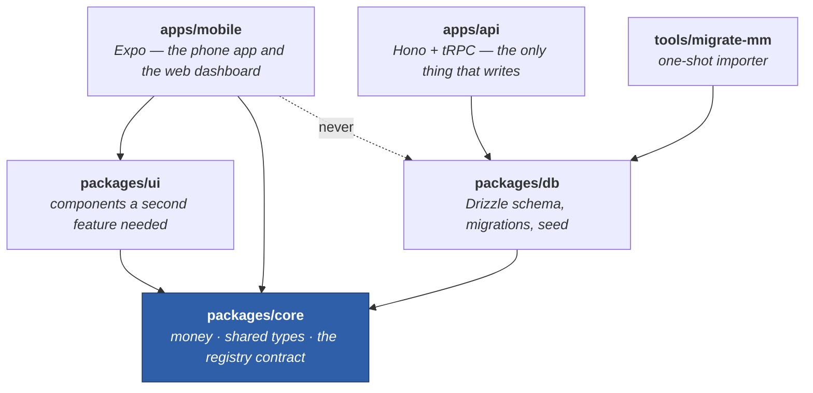
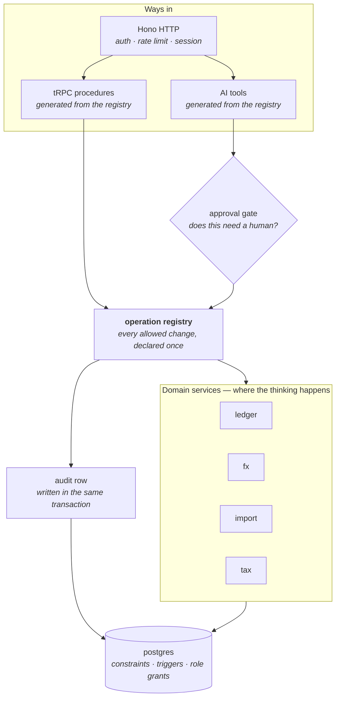
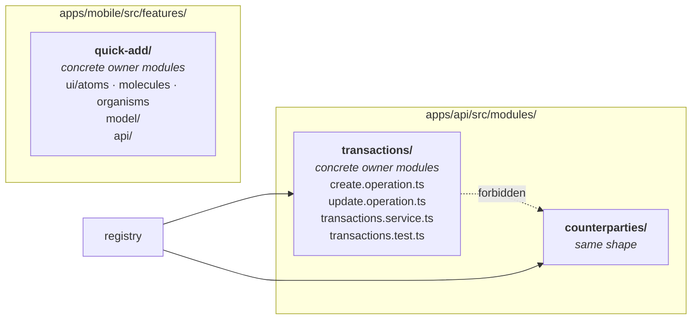
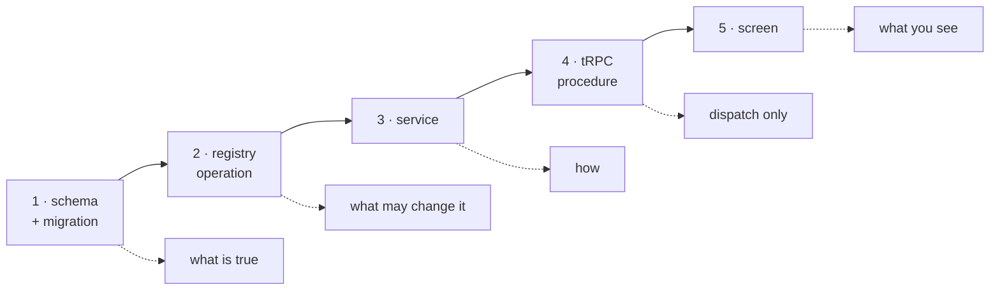

# Architecture Map

There are two specification trees and it is not obvious which one answers a
given question. This page is the index, plus the shape of the code.

**[`SPEC.md`](https://github.com/VoltLightning/waltning/blob/main/SPEC.md)
specifies the system.** Data model, currency handling, security, the AI
assistant, tax. Everything underneath the interface, with the reasoning kept
next to each decision.

**[`docs/specification/`](https://github.com/VoltLightning/waltning/tree/main/docs/specification)
specifies the interface.** Principles, design system, 17 user journeys, 32
screens, the list of every allowed change, and every number the interface
promises.

## Which document answers what

| Question | Document |
|---|---|
| What are the tables, and what rules do they enforce? | `SPEC.md` §6 |
| How do amounts, currencies and exchange rates work? | `SPEC.md` §7 → [[Money and FX]] |
| Why can't a personal expense reach a tax report? | `SPEC.md` §13 → [[Tax Isolation]] |
| What can the AI assistant do, and what needs my approval? | `SPEC.md` §11 → [[The Operation Registry]] |
| What runs where, and how is it deployed? | [`architecture/01`](https://github.com/VoltLightning/waltning/blob/main/docs/specification/architecture/01-context-and-containers.md), [`05`](https://github.com/VoltLightning/waltning/blob/main/docs/specification/architecture/05-deployment.md) |
| What happens with no network? | [`architecture/08`](https://github.com/VoltLightning/waltning/blob/main/docs/specification/architecture/08-offline-and-concurrency.md), [`09`](https://github.com/VoltLightning/waltning/blob/main/docs/specification/architecture/09-connectivity.md) → [[Offline and Sync]] |
| What does the phone hold, and what does the server hold — complete versus authoritative? | [`architecture/14`](https://github.com/VoltLightning/waltning/blob/main/docs/specification/architecture/14-local-first.md) → [[Offline and Sync]], [[Home]] |
| Where does a new file go? | [`architecture/10`](https://github.com/VoltLightning/waltning/blob/main/docs/specification/architecture/10-code-structure.md) |
| How is any given figure calculated? | [`computations.md`](https://github.com/VoltLightning/waltning/blob/main/docs/specification/computations.md) |
| What changes to my data are possible at all? | [`operations.md`](https://github.com/VoltLightning/waltning/blob/main/docs/specification/operations.md) |
| What does this screen do? | [`screens/`](https://github.com/VoltLightning/waltning/tree/main/docs/specification/screens) — S01–S34 |
| What is the user actually trying to do? | [`flows/`](https://github.com/VoltLightning/waltning/tree/main/docs/specification/flows) — J01–J17 |
| What is known to be wrong? | [`defects.md`](https://github.com/VoltLightning/waltning/blob/main/docs/specification/defects.md) |
| In what order is this being built? | [[Project Status]] — the sequence lives on the board, not in the specification |

## The packages, and which way they depend

An arrow means "needs this to compile". They all point downward, and nothing
points back up.

**`core` sits at the floor and runs identically on the phone and the server.**
It is allowed two dependencies — a decimal-arithmetic library and a
schema-validation library — and nothing else. No Node-specific APIs, no database
driver.

That constraint is doing real work. It is what makes a balance calculated on
your phone with no signal and the same balance calculated on the server *the
same number*, rather than two implementations that agree most of the time and
diverge on the case nobody tested.

One thing this diagram doesn't show: `core` running on both ends is what makes
the phone and the server *agree*, not what makes the phone a thin client. The
phone's own database holds the whole ledger — every transaction, not a cache
of recent ones. The server is authoritative because it hosts the guarantees
(the triggers, constraints and role grants in `packages/db`) and admits every
write, not because it holds more data than the phone does. See
[`architecture/14`](https://github.com/VoltLightning/waltning/blob/main/docs/specification/architecture/14-local-first.md).

**`mobile` never imports `db`.** The phone has no business holding database
credentials or migration files, and "we would notice in review" is not a
control — a test enforces it.

| Package | What it holds |
|---|---|
| `apps/mobile` | Expo / React Native — the iOS app and the web dashboard from one codebase |
| `apps/api` | The server: the registry, the AI runtime, import pipelines, rate sync, exports |
| `packages/core` | Money arithmetic, shared types, validation schemas, the registry contract |
| `packages/db` | Database schema, migrations, seed data, exchange-rate backfill |
| `packages/ui` | Shared components — anything a *second* feature needed |
| `tools/migrate-mm` | One-shot importer from the old app, with verification gates |

## Inside the API

Requests arrive two ways and converge immediately. That convergence is the
point: there is one path to the database, and the AI assistant is on it rather
than beside it.

Three rules keep those boxes from blurring into each other:

- **Routers dispatch, services compute, PostgreSQL enforces.** A router that
  starts calculating is a calculation the AI path cannot reach.
- **Only screens fetch data.** A small component that fetches for itself cannot
  be shown in a preview, cannot be tested without a server, and cannot render
  from the phone's offline copy.
- **No abstraction before the third use.** No repository layer over the
  database, no generic helpers, no event bus, no managers. Two similar things
  are a coincidence; three are a pattern.

## How the code is laid out

**Features are the primary axis; layers live inside them.** The common
alternative — global `controllers/`, `services/`, `models/` folders — means a
single change touches all three and reads as three unrelated edits, and nothing
stops one feature reaching into another's internals.

Only concrete package-export subpaths are public; each resolves directly to its
owner module, and barrels are forbidden. **No module imports another** — they
are composed at the registry on the server and in the route tree on the phone.
A test enforces the module direction and Biome refuses barrels.

Atomic design — atoms, molecules, organisms — applies as a **scale inside one
feature**, never as three global folders. A component moves to `packages/ui`
when a *second* feature uses it, not when it looks reusable.

## A feature is a vertical slice

Built in this order. It is a hard requirement, not a preference.

**Never start at the screen.** Starting there produces an interface that
promises a number nothing calculates, and the database then gets bent to fit a
layout. Work that is genuinely only visual is the exception and starts where it
says.
