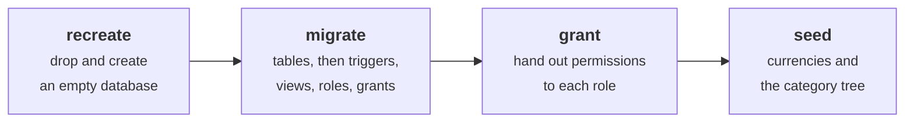
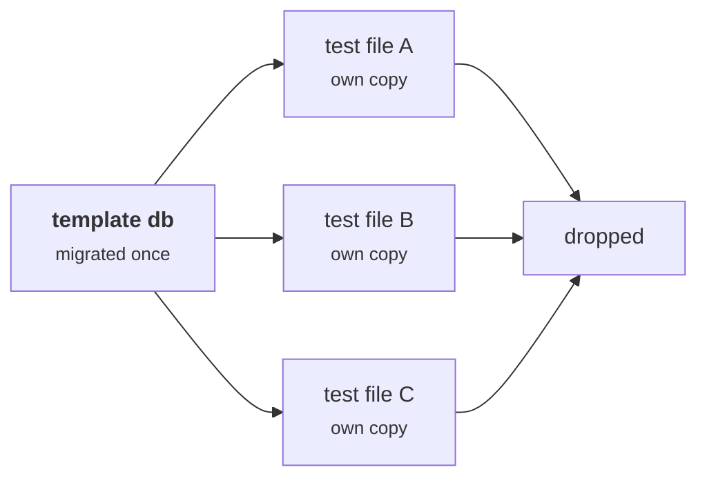
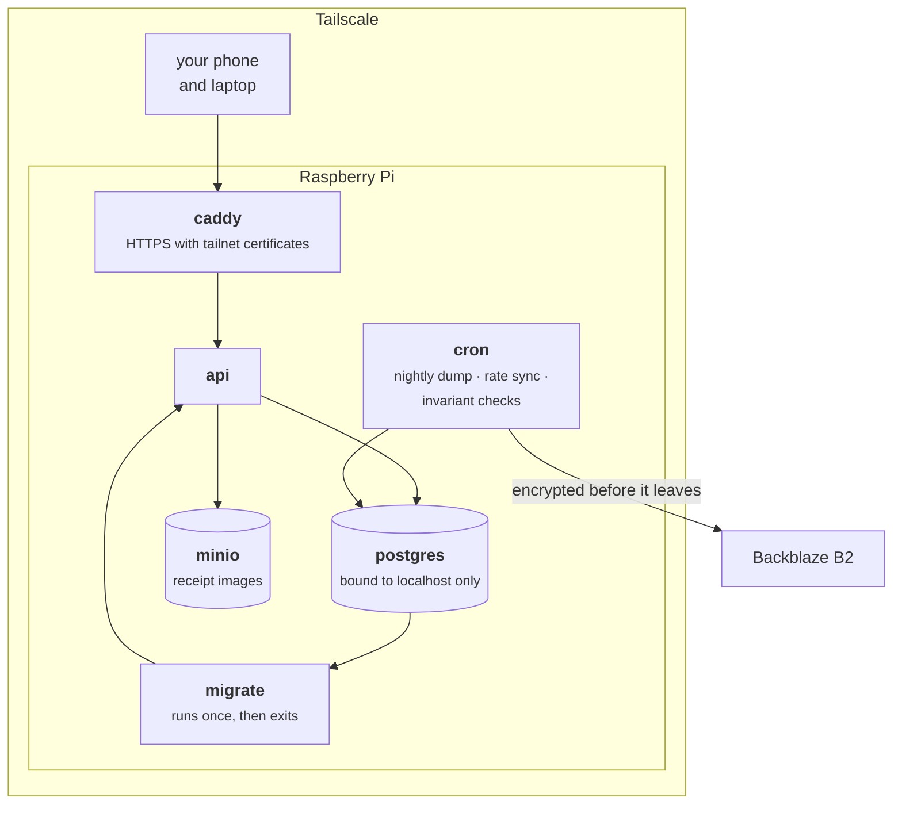
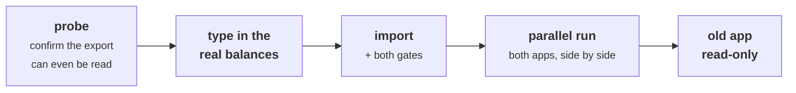

# Getting Started

Two paths: a laptop, where you want it running in five minutes, and a Raspberry
Pi, which is what it is actually for.

## On a laptop

Node ≥ 22, pnpm ≥ 10, Docker.

```sh
git clone https://github.com/VoltLightning/waltning && cd waltning
pnpm install                 # also installs the git hooks
cp .env.example .env         # fill it in — note the three database URLs
pnpm db:reset                # drop, migrate, grant, seed — one command
pnpm dev
```

`pnpm db:reset` is the one to reach for. Nothing in the database design is
settled yet, so changing it should never involve hesitation: edit the schema
file, regenerate, reset.



The four steps exist separately for when you want to watch one of them; `db:reset`
runs all four.

### The three database URLs

`.env.example` declares three connections, and they are not redundant. Each
connects as a different database user with different permissions.

| Variable | Connects as | Allowed to |
|---|---|---|
| `MIGRATE_DATABASE_URL` | the superuser | Run migrations. Nothing else, ever |
| `APP_DATABASE_URL` | `waltning_app` | Everything the API normally does |
| `EXPORT_DATABASE_URL` | `waltning_export` | Read one business-only view |

**The separation is the tax guarantee itself**, not tidiness. If a query fails
with a permission error, the design is working — the fix is to change what the
query asks for, and never to swap in a more powerful connection. Doing that
quietly voids [[Tax Isolation]], and nothing will tell you.

The API's user is deliberately not a superuser, because a superuser ignores
every permission in the database. Running as one makes every query succeed and
every boundary decorative, while the whole test suite still passes.

### Running the tests

```sh
pnpm test        # against a real Postgres — pnpm db:up first
pnpm verify      # formatting + types + tests. This is the gate
```

There are no database fakes. Each test file gets its own database, copied from
an already-migrated template and thrown away afterwards.



A faked constraint tests the fake rather than the constraint — and constraints
are where this system's guarantees actually live, so testing against anything
else would be testing the wrong thing.

## On a Raspberry Pi

The real deployment. Everything runs as containers under Docker Compose, and
the only route in is Tailscale — a private network that connects your own
devices to each other and nothing else.



Three things worth knowing before you start:

**Migrations are their own container, not something the API does on startup.** A
failed migration has to stop the deployment rather than leave an API serving a
half-changed database — and the later migrations create triggers, views, roles
and permissions, which the API's own user does not have (and should not have)
the rights to apply.

**PostgreSQL listens only on the machine itself.** Devices reach the API over
Tailscale; nothing is forwarded from your router, and there is no public address
to scan.

**Backups are encrypted before they leave the Pi**, and restoring is part of the
written procedure. A backup nobody has ever restored is a hypothesis.

One consequence of restoring that is easy to miss: **database roles are not
included in a normal dump.** After restoring into a fresh database, the
permission setup has to be applied again, or the export boundary silently is not
there. There is a check that detects it.

The full procedure is in
[`architecture/05-deployment.md`](https://github.com/VoltLightning/waltning/blob/main/docs/specification/architecture/05-deployment.md).
Note that this diagram is the specified target — see [[Project Status]] for what
is actually built today.

## Migrating from Money Manager

`tools/migrate-mm` is a one-shot importer with verification gates, run as
`pnpm mm:all`. It deliberately does not import five years of history; §8.0
explains that scope decision, and the eleven-step procedure with its gates and
the point past which rollback stops being practical is in
[`migration-runbook.md`](https://github.com/VoltLightning/waltning/blob/main/docs/specification/migration-runbook.md).



The gate that matters is the one comparing calculated balances against balances
you have typed in by hand from the old app. **Without those hand-entered
figures it compares a number to itself and cannot fail** — a check that always
passes, which is worse than no check, because it produces confidence instead of
a gap.

The parallel run is there for a different reason. Whether the import was
*faithful* can be checked automatically. Whether the source was *complete* is a
property of how the old records were kept, and that only becomes visible by
using both for a while.
