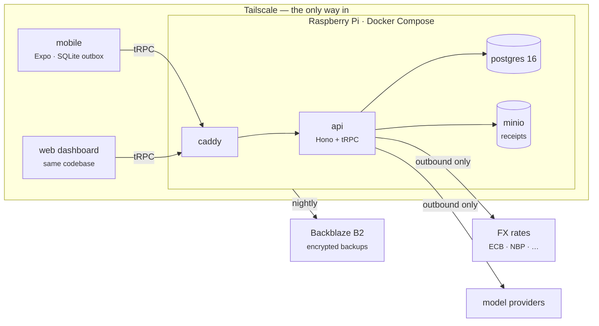

# Waltning

Self-hosted personal finance: an offline-capable mobile app, a web dashboard,
receipt scanning, bank-statement import, and an LLM agent with typed tools —
over a multi-currency Postgres ledger that runs on your own hardware and is
reachable only through your own VPN.

This wiki is the **orientation layer**. The specification itself lives in the
repository and stays there; these pages exist to get you to the right document
with the right context, and to hold the reasoning that does not belong next to
code.

Every external arrow is outbound. There is no public ingress, so there is no
login page on the internet to find.

## Start where your question is

| You want to | Go to |
|---|---|
| Run it on a laptop, or deploy it to a Pi | **[[Getting Started]]** |
| Understand how the pieces fit, or find the document that answers something | **[[Architecture Map]]** |
| Know how every write in the system is defined | **[[The Operation Registry]]** |
| Understand amounts, currencies and rates | **[[Money and FX]]** |
| Know what the phone can do with no server | **[[Offline and Sync]]** |
| Understand why a personal expense cannot reach a tax report | **[[Tax Isolation]]** |
| Know why something was built this way — or refused | **[[Decisions]]** |
| Look up a term | **[[Glossary]]** |
| See what is actually built versus specified | **[[Project Status]]** |
| Change the code | **[[Working on Waltning]]** |

## The four ideas everything else follows from

**One registry, two consumers.** Every write in the system is a named,
Zod-validated, audited operation in one registry. The screens and the agent are
two consumers of the same declarations — the agent does not get a second,
weaker path to your ledger. See [[The Operation Registry]].

**Postgres enforces; services compute; routers dispatch.** Anything the system
promises can never happen gets a service check for the good error message *and*
a database constraint that holds when the application code is wrong. A
guarantee that lives only in prose is not a guarantee.

**Money is decimal strings, end to end.** `numeric(20,8)` in Postgres, strings
in TypeScript, arithmetic only through `money.ts`. A JavaScript number holding
an amount is a bug, and the linter treats it as one. See [[Money and FX]].

**The tax boundary is structural, not procedural.** Exports run under a
database role that can read one business-only view and nothing else. A personal
row reaching a tax report fails loudly instead of slipping through. See
[[Tax Isolation]].

## What this is not

Not a product, not a service, and not accepting feature requests. One
developer, one ledger, one Raspberry Pi. It is public because the reasoning is
worth reading, not because it wants users — see
[CONTRIBUTING.md](https://github.com/VoltLightning/waltning/blob/main/CONTRIBUTING.md).

> **Every personal name, bank and balance in this project is fictional.** The
> design came from a real five-year ledger and the examples keep its shape,
> because the reasoning only holds if the examples are realistic. The
> identities are not. Row counts, currency lists and the tax scheme are real:
> they describe the problem and identify nobody.
