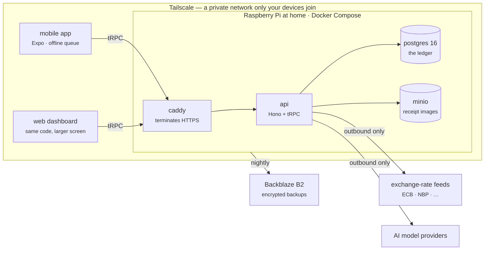
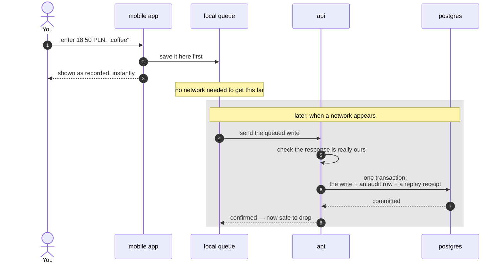

# Waltning

Personal finance software you run yourself. A phone app that keeps working with
no signal, a web dashboard for the sitting-down work, receipt scanning,
bank-statement import, and an AI assistant that can only take actions you have
defined for it. Underneath is a PostgreSQL database on hardware you own,
reachable only over your own private network.

This wiki is the **orientation layer**. The specification itself lives in the
repository and stays there; these pages exist to get you to the right document
with enough context to read it, and to hold the reasoning that does not belong
next to code.

## What is where

Everything runs on one Raspberry Pi in your home. Nothing on the public
internet accepts a connection — the only way in is Tailscale, a private network
that joins your own devices together and refuses everyone else.

**Every arrow leaving the house points outward.** The Pi calls the exchange-rate
feeds and the AI providers; nothing out there can call the Pi. There is no login
page on the internet for anyone to find, because there is no page on the
internet at all.

Three names in that diagram, in plain terms:

- **Hono** — the web server the API is built on. Small and quick, which matters
  on a Raspberry Pi.
- **tRPC** — how the app talks to the API. You write a function on the server
  and call it from the app; the types travel with it, so a rename that breaks
  the app fails to compile rather than failing in your hand.
- **Caddy** — the front door. Handles HTTPS certificates without configuration.

## What happens when you record a coffee

The whole system in one path. This is the same sequence whether you tap it in
or the assistant does it for you.

Two things in there are the whole design. **Your entry is saved locally before
anything else**, so losing signal never loses a capture. And **the server is the
only thing that decides a write is real** — the phone holds an intention until
the server admits it.

## Start where your question is

| You want to | Go to |
|---|---|
| Run it on a laptop, or set it up on a Pi | **[[Getting Started]]** |
| See how the pieces fit, or find the document that answers something | **[[Architecture Map]]** |
| Understand how every change to your data is defined | **[[The Operation Registry]]** |
| Understand amounts, currencies and exchange rates | **[[Money and FX]]** |
| Know what the phone can do with no server | **[[Offline and Sync]]** |
| Understand why a personal expense cannot reach a tax report | **[[Tax Isolation]]** |
| Know why something was built this way — or refused | **[[Decisions]]** |
| Look up a term | **[[Glossary]]** |
| See what is actually built versus specified | **[[Project Status]]** |
| Change the code | **[[Working on Waltning]]** |

## The four ideas everything else follows from

**One list of allowed changes, used by both the app and the AI.** Every change
to your data is a named entry in a single registry — it declares what inputs it
accepts, whether it can run without asking, and what it records afterwards. The
screens and the assistant both go through that same list. The assistant does not
get a second, weaker route to your ledger. See [[The Operation Registry]].

**The database enforces; the code explains.** Anything the system says can never
happen gets checked twice: once in the application, so you get a clear message,
and once in PostgreSQL as a constraint, so it still holds when the application
is wrong. A rule that exists only in prose is not a rule.

**Money is never a floating-point number.** Amounts are stored as exact decimals
and passed around as text, and arithmetic goes through one small module. A
computer's `0.1` is not quite `0.1`, and over five years those crumbs add up to
a balance that is *nearly* right — which is the worst kind of wrong, because
nothing alerts on it. See [[Money and FX]].

**Tax separation is structural.** The export path connects to the database as a
user that can read one business-only view and nothing else. A personal
transaction reaching a tax report fails loudly instead of slipping through. See
[[Tax Isolation]].

## What this is not

Not a product, not a service, and not taking feature requests. One developer,
one ledger, one Raspberry Pi. It is public because the reasoning is worth
reading, not because it wants users — see
[CONTRIBUTING.md](https://github.com/VoltLightning/waltning/blob/main/CONTRIBUTING.md).

> **Every personal name, bank and balance in this project is fictional.** The
> design came from a real five-year ledger and the examples keep its shape,
> because the reasoning only holds if the examples are realistic. The identities
> are not. Row counts, currency lists and the tax scheme are real: they describe
> the problem and identify nobody.
