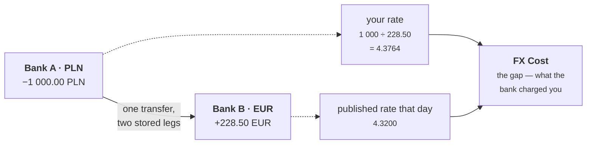
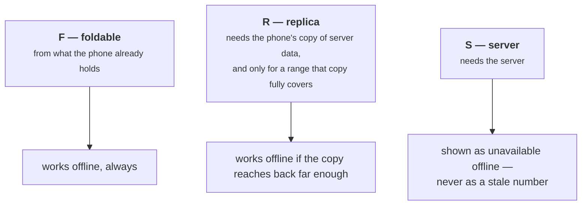

# Money and FX

Specified in `SPEC.md` §7. This is the page to read before any of the others.

## There is no main currency

Most finance apps ask you to pick a home currency and convert everything into
it. This one does not. Balances stay in the currency they are actually in, and
conversion happens only when something is **displayed**, at a rate you can point
at.

That is not a stylistic preference. A stored figure that has already been
converted has thrown away the rate that produced it, and you cannot reconstruct
it later once the rate has moved. Convert on display and the original is always
still there.

## How an amount is stored

**Exact decimals in the database, text in the code, and one module for
arithmetic.**

The database column is `numeric(20,8)` — PostgreSQL's exact decimal type, 20
digits with 8 after the point. Eight because cryptocurrency needs them. In
TypeScript the value is carried as a **string**, and calculations go through a
single small module built on a decimal library.

A JavaScript number holding an amount is treated as a bug, not as a shortcut.
Computers store fractions in binary, and `0.1` has no exact binary form the same
way `1/3` has no exact decimal one. The error is tiny and it accumulates. Over
five years it surfaces as a balance that is *nearly* right — the worst kind of
wrong, because nothing ever alerts on it.

One detail worth knowing if you touch that module: it uses its **own private
copy** of the decimal library's settings rather than configuring the shared one.
With a shared configuration, any dependency anywhere in the project could change
the rounding behaviour of the entire ledger with one call, and the symptom would
be a figure rounding the wrong way in a report six months later, with nothing in
the change history pointing at it.

## Dates are text, not timestamps

An accounting date is a bare `YYYY-MM-DD` string. No date arithmetic, no
timezone conversion.

A transaction dated the 1st must be on the 1st for everyone. Stored as a
timestamp, it becomes the 31st of the previous month for anyone far enough east
— and month boundaries are exactly where that does the most damage, because that
is where periods close and reports are filed. When the capture time genuinely
matters it is kept separately.

## Two kinds of rate

The distinction most of §7 rests on:

| | |
|---|---|
| **Reference rate** | What a currency was worth on a given date, published by a central bank |
| **Realized rate** | What *you* actually got, implied by the two sides of a transfer you made |

A cross-currency transfer stores **both sides**, so the rate you got is a
recorded fact rather than something inferred later.

Without both legs, the difference between those two rates just disappears into
the balance and looks like a rounding mystery. With them, it has a name and a
number: **FX Cost**, the spread your bank took, shown rather than absorbed.

Rates are fetched **per date**, not "latest". A transaction gets the rate that
applied on *its own* date, which is why there is a backfill process and why a
missing rate is an explicit state rather than a quiet fall back to the nearest
one available. `SPEC.md` §7.6 covers overriding a rate by hand, and §7.7 covers
the sources — including one currency whose published rate reflects only about
half a percent of what it actually trades at, which is a data problem with a
designed remedy rather than an undesigned gap.

## Every figure has exactly one definition

[`computations.md`](https://github.com/VoltLightning/waltning/blob/main/docs/specification/computations.md)
defines every number the interface shows: account balance, net worth in both the
*mine* and *ours* senses, spend for a period, spend by category, what each
person owes, the FX cost above, confidence scores, and the rest.

Each one is labelled with **where it is allowed to be calculated**, because the
phone does not always have the data.

Getting a label wrong is another failure that looks like health. The figure
renders, it looks plausible, and it was calculated from data the phone does not
actually have. That is why the classification is written down per figure and
reviewed, rather than decided by whoever writes the screen.

§15 of `computations.md` lists what deliberately has **no** definition, which is
usually the more interesting list.
