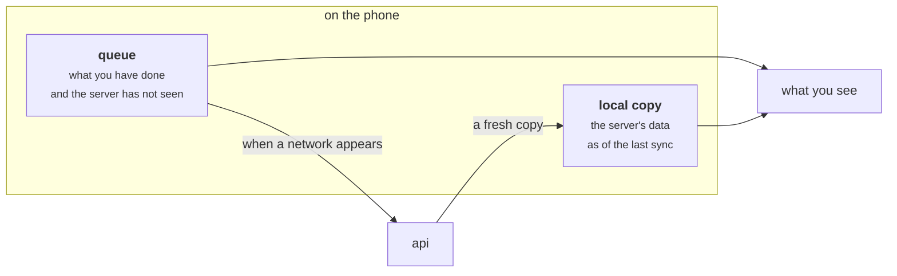
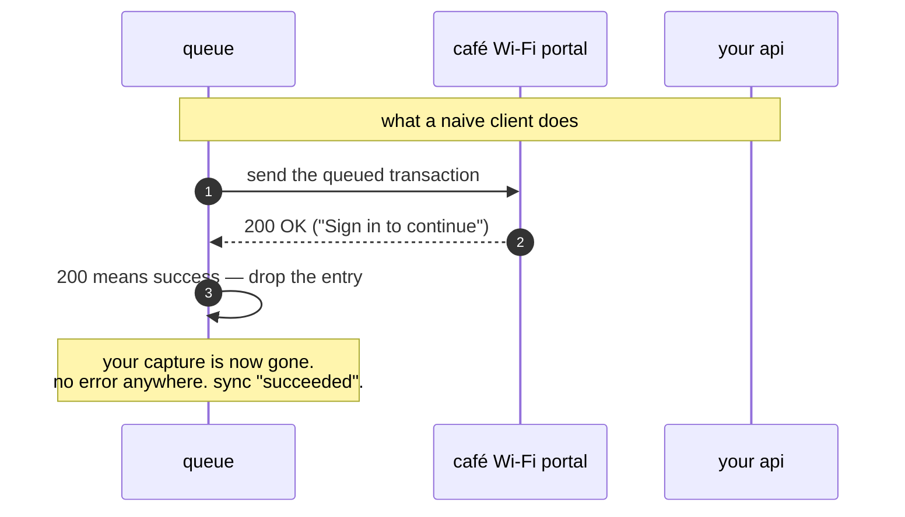
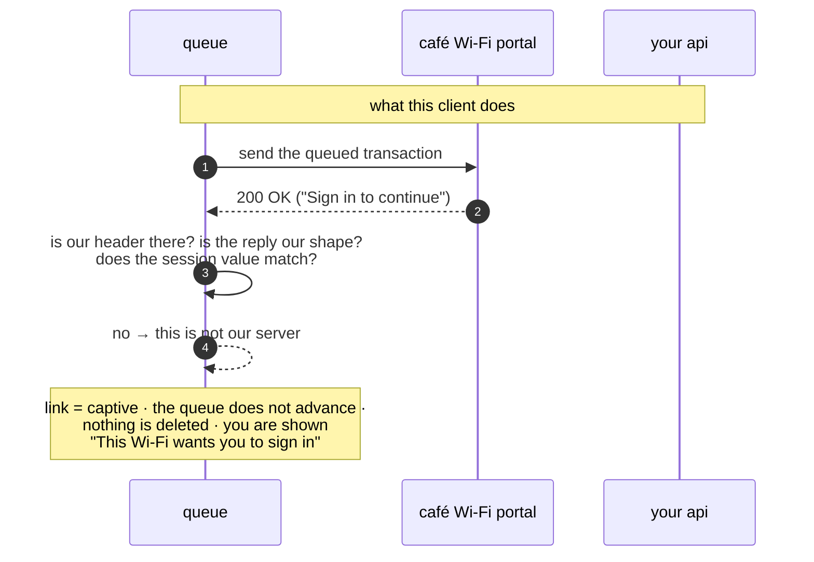
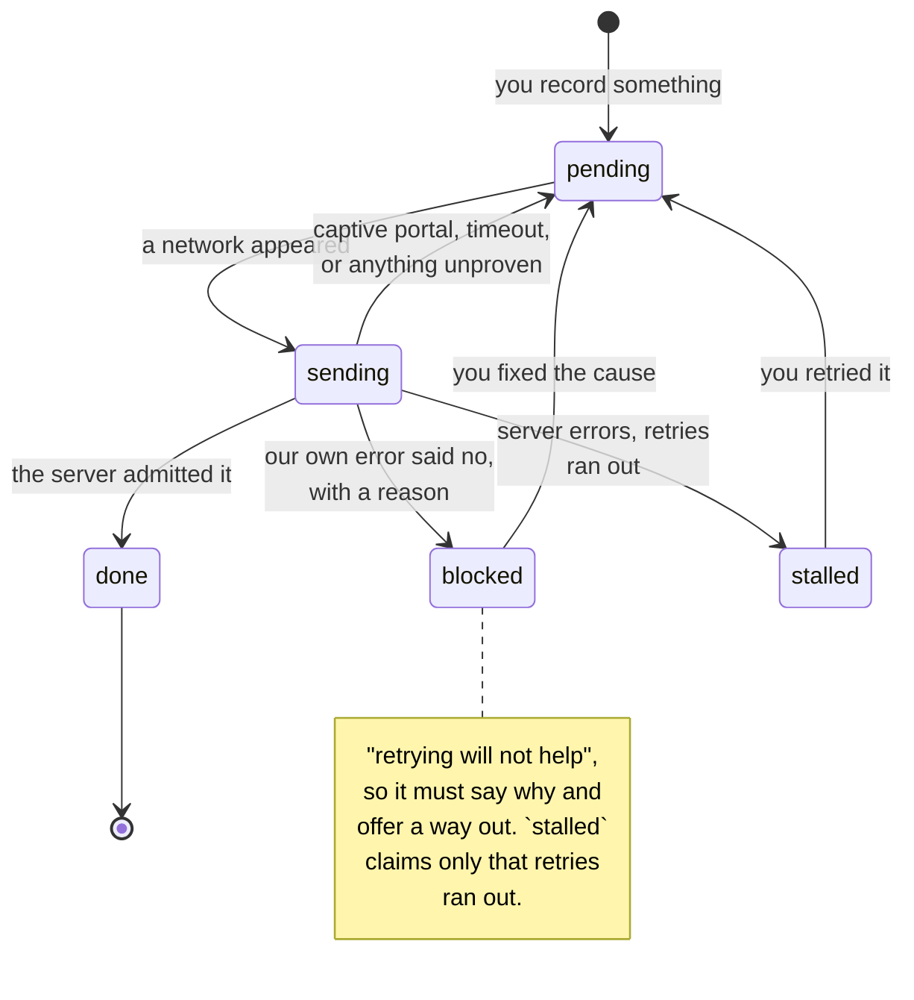

# Offline and Sync

The phone works with no server, indefinitely — not for the few minutes while a
lift moves. Specified in
[`architecture/08`](https://github.com/VoltLightning/waltning/blob/main/docs/specification/architecture/08-offline-and-concurrency.md)
and
[`architecture/09`](https://github.com/VoltLightning/waltning/blob/main/docs/specification/architecture/09-connectivity.md),
and reviewed adversarially — several claims in the first draft were shown to be
wrong and are now recorded as such.

## The two halves

Anything you record goes into a **queue on the phone** — a local database that
survives being closed, killed or restarted. Anything you *read* comes from a
**copy of the server's data** that the phone keeps, plus whatever is still
sitting in the queue.

**Your balance is the copy plus the queue.** That is why a figure stays correct
while you are offline instead of freezing at whatever it was when the signal
dropped — the phone folds in what it knows you have done.

Sync is explicit and goes both ways. It is not a background process you have to
take on faith.

Which numbers can be shown offline is a **declared property of each number**,
not something you find out when a screen renders blank on a train — see the
F / R / S classes in [[Money and FX]].

## Rule 0 — a 200 is not a success

The most important rule here, and the least intuitive.

A **captive portal** is the sign-in page a café or airport Wi-Fi shows before it
lets you online. It intercepts everything. Crucially, it does not return an
error — it answers *every* request, including a POST of your transaction, with
`200 OK` and a page of HTML.

Software that decides "did this work?" by looking at the status code will read
that as success, drop the entry from the queue, and move on.

The write never reached the ledger, the entry is deleted, and every indicator in
the app is green. This is the failure mode this project fears most: **the system
looks healthier than if it had simply failed.**

So a response has to **prove it is ours before its status code counts for
anything** — our own header, a well-formed reply of the shape our API sends, and
the session's one-time value.

**Rule 1 follows from it:** only an error that arrives in our own error format
may mark an entry as rejected. A portal's HTML cannot condemn your write.

This generalises well past connectivity, and it is written into the project's
rules as a habit for any client: **check that a response is really from who you
think, before you trust what it says.**

## The life of a queued entry

**The transition that is missing is the point.** There is no path from `sending`
straight to `done` on a response that has not proved itself — which is the one
arrow standing between a café Wi-Fi and a week of deleted captures.

## Sending twice is safe

The phone may send the same entry twice. It lost the *response*, not the write,
and it has no way to tell those apart.

The obvious fix is a unique index on some external id — but a unique index only
objects on insert, so it does nothing for an action that updates. Instead the
server keeps a **receipt**: the queue entry's id plus a fingerprint of the
request. Send it again and you get the original answer back without the work
happening twice. Send *different* content under the same id and it is rejected
rather than quietly applied.

Order comes from a counter that only ever goes up — **not from the clock.** A
phone's clock jumps backwards when it crosses a timezone or corrects itself
against a time server, and ordering by timestamp would silently reorder your
writes around those jumps.

## Surviving an app update

An entry can sit in the queue across an app version change, which is why every
action declares a version. A write queued by last week's app must either still
mean exactly what it meant then, or refuse — it must never be reinterpreted by
this week's schema into a *different* write.

## The harder cases

`architecture/08` works through the ones that are not obvious: a receipt photo
and its draft transaction are one intention, not two; a "pay off the remainder"
amount calculated against a total that has since changed; a bulk action freezing
the set of rows it applies to at the moment you approve it, not at the moment it
runs; accepting fifty suggestions as one undoable step; duplicate detection
running when the queue drains rather than only at import.

It closes with **what is deliberately not built** — the section to read before
proposing a conflict-resolution engine. One user with two devices is not the
problem that CRDTs solve, and the cost of pretending otherwise is a system
nobody can reason about.
