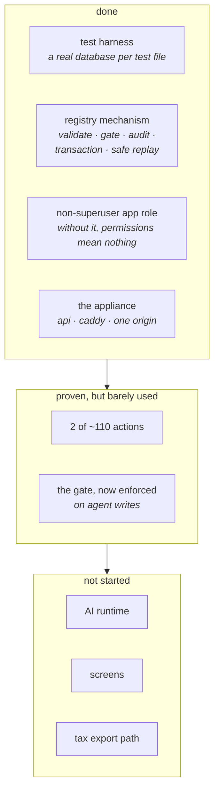

# Project Status

**The specification is complete. The build is early.** Those are two different
things, and this page exists so the first is not mistaken for the second.

## Where the build actually is

Foundations are in place: the test harness, the registry mechanism, and the
non-superuser database role. The registry is proven end to end — declaring an
action, validating its input, deciding whether it needs approval, doing the
work, recording it, and surviving being sent twice. Each of those has a test
that was **broken on purpose first**, to confirm it actually fails when it
should.

What does not exist yet is most of the surface.

## What is specified

Seventeen user journeys and thirty-two screens, each written against a template
so a missing section is visible rather than merely absent. All **75** numbered
open questions across the screens and journeys are decided, and each decision is
recorded beside the question it answers rather than collected somewhere else —
so the reasoning stays next to the thing it governs.

Three mechanical audits back that up rather than resting on it: every screen and
journey matches its template, every action a screen references exists in the
registry, and no unresolved markers remain. Those audits run as **tests**,
because a documented check that depends on someone remembering to run it is not
a check.

Depth is **declared, not uniform.** Every screen has all nine sections; how much
prose each gets is tiered deliberately. A thin screen is not a stub — it is one
whose open questions are worth more than its prose would be.

Ten adversarial reviews produced 101 findings, tracked with their status in
[`defects.md`](https://github.com/VoltLightning/waltning/blob/main/docs/specification/defects.md).

## Known gaps — carried, not forgotten

True at the time of writing. This list exists so none of them quietly becomes
folklore.

- **Two actions exist out of roughly 110.** The mechanism is proven; the surface
  is not.
- **The approval gate decides, but nothing calls it yet.** The decision logic and
  its declaration check are tested. The AI runtime and the approval card that
  would consume them do not exist.
- **`EXPORT_DATABASE_URL` is declared and never read** — the tax export path is
  not built.
- **`packages/ui` holds no components yet.** The design system names 97; the
  package compiles three empty index files. A component moves there when a
  *second* feature uses it, so this stays empty until there is a second feature.

## Not yet decided

**Speech recognition on the device** needs a few minutes on real hardware. It
decides whether voice capture works with no signal. Nothing earlier depends on
it, so the registry, the API, the screens and the sync all proceed without
knowing the answer.

**Push notifications** currently route through a third party's service, in a
system whose entire argument is that you hold your own data. To be decided
before push ships — see [[Decisions]].

## How to read this against the repository

The specification describes the finished system in the present tense, because
that is what a specification is for. **This page is where you find out what
actually runs.** When the two disagree, this page is the one that is wrong and
should be fixed — the repository is the record.
