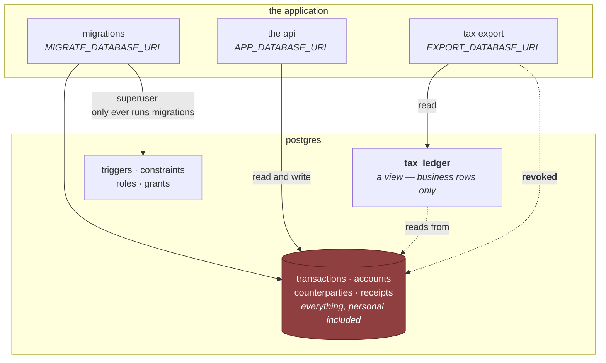
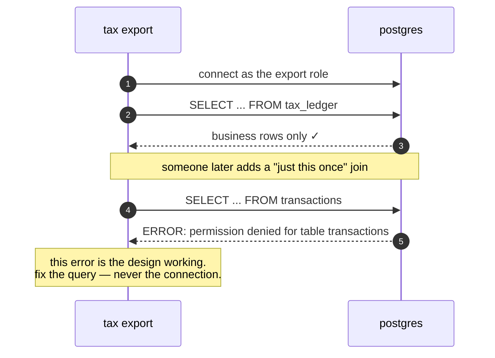
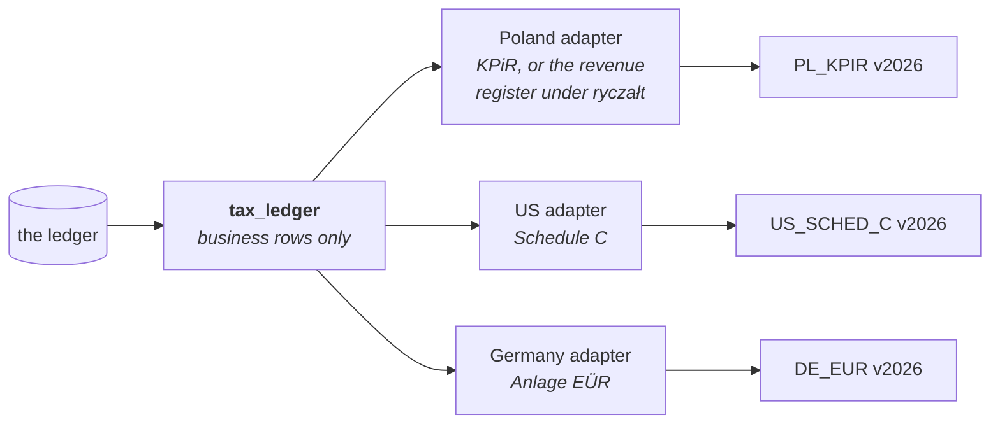

# Tax Isolation

Specified in `SPEC.md` §13. The strongest guarantee in the system, and the one
most easily destroyed by a well-meaning fix.

## The guarantee

**A personal expense cannot reach a tax report.** Not "is filtered out of" —
cannot reach.

Everything that produces a tax document reads a **view** called `tax_ledger`. A
view is a saved query that behaves like a table; this one shows only business
rows. The tax code connects to the database as a **role** — a database user —
that is permitted to read that view and nothing else. The underlying tables are
explicitly withdrawn from it.

So personal transactions are not excluded by a `WHERE` clause that a future
adapter might forget to write. They are **unreachable from where that code is
standing.**

## Three connections, three sets of permissions

The application opens three separate connections to the same database, each as a
different role. This is the whole mechanism.

The dotted line marked **revoked** is the guarantee. It is not a convention or a
code review habit — it is a permission that PostgreSQL enforces on every
statement, no matter who wrote it.

## Why a role and not a query

A filter written in application code holds right up until someone adds an
adapter for a fourth country at one in the morning and copies a query from the
third. The filter is one line. Its absence looks like nothing at all.

A withdrawn permission does not care who wrote the query or how tired they were.
The statement fails, loudly, at the boundary — and the error names the table it
was not allowed to read.

This is the general pattern the whole project follows: **anything that must
never happen gets a check in the code for the clear message, and a database
constraint for when the code is wrong.** A guarantee that lives only in prose is
a wish.

## The trap

**A permission error usually means the design is working.**

If an export query fails on permissions, the fix is to change what the query
asks for. Pointing it at `APP_DATABASE_URL` will also make it pass — and will
silently destroy the guarantee, permanently, with every test still green and
nothing in the change that looks wrong.

The same logic applies one level up. The API's own role is deliberately **not a
superuser**, because a superuser bypasses every permission there is. Run as one
and every query succeeds, every boundary becomes decorative, and the whole suite
still passes. That is the archetype of failure that looks like health: the
system has never been more responsive, and none of its guarantees hold.

## Fields, not actions

The tax boundary runs through **fields**. The permission system that governs the
AI assistant runs through **actions**. They do not line up, and the gap between
them is exactly where a routine recategorisation could quietly move transactions
out of tax scope.

How the approval gate closes that gap is in [[The Operation Registry]].

## One shape, many countries

`tax_ledger` has a single structure. Each country gets an **adapter** that
projects it into that country's forms.

Each output is a **scheme**, and a scheme carries a year: `PL_KPIR v2026`. Forms
change between years, and a report you regenerate in three years has to still
match what you actually filed — so the version is part of the identity, not
metadata about it.

Terms are in the [[Glossary]]. §13.4 covers closing a period, including the
report that catches scope changes the gate deliberately lets through: changing a
category can move tax scope indirectly, and the answer is to surface it once at
close rather than interrupt every recategorisation you ever do.
