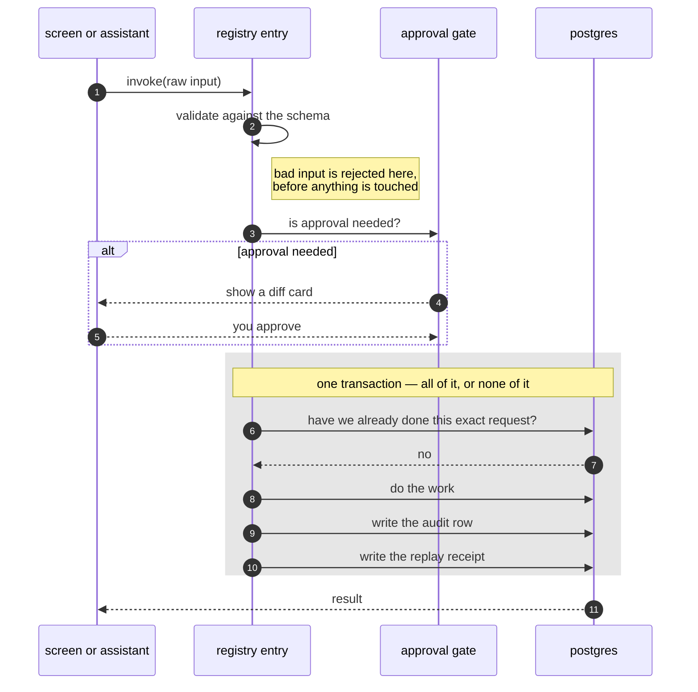
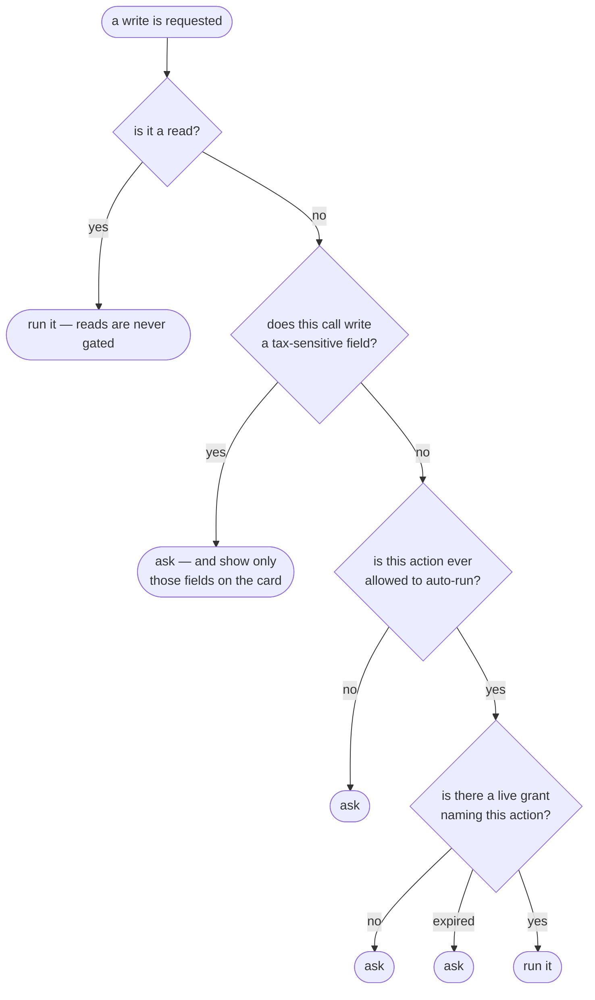

# The Operation Registry

**Every change to your data is a named entry in one list.** Not "should be" — is.
The screens and the AI assistant are two users of the same list, and there is no
other way to write to the ledger.

Specified in `SPEC.md` §11.0 and enumerated in
[`operations.md`](https://github.com/VoltLightning/waltning/blob/main/docs/specification/operations.md).

## Why a list at all

An AI model with database access can write any statement it can compose. The
usual answer is to let it write SQL and have a human approve the query — which
asks you to spot a wrong `WHERE` clause in a query you did not write, at the
moment you are trying to get something done. That is a review that looks like a
control and works like a rubber stamp.

Here the assistant gets **a fixed set of typed tools instead of SQL**. It cannot
express an action that is not on the list. The question stops being "is this
query safe?" and becomes "should this action exist?" — asked once, at design
time, by someone with the whole system in view.

The list is also why the two paths cannot drift apart. One declaration generates
both the app's API call and the assistant's tool. An action the app can perform
and the assistant cannot is not something you can build by accident.

## What one entry declares

```ts
{
  name,                 // "create_transaction"
  input,                // the exact shape of acceptable input (a Zod schema)
  kind,                 // read, or write
  autoEligible,         // may this ever run without asking?
  offlineEligible,      // may the phone queue this with no signal?
  opVersion,            // which version of this action the queued write meant
  taxSensitiveFields,   // fields that always need approval, whatever else is true
  audit,                // what to record: entity, action, before, after
  description,          // what the assistant is told this does
  handler,              // the actual work
}
```

**Zod** is a validation library: the schema is a value the code can inspect, not
just a type that disappears when it compiles. That matters twice over — it
checks input at runtime, *and* it can be read to generate the assistant's tool
definition and to check declarations against each other.

`offlineEligible` and `opVersion` exist because the phone's queue can hold a
write for days, across an app update. See [[Offline and Sync]].

## What actually happens on a write



The shaded block is one database transaction. If any line inside it fails,
every line inside it is undone — you cannot end up with the change applied and
the audit row missing, or the receipt written for work that did not happen.

## Three things attached where they cannot be forgotten

Each of these was, at some point, in the wrong place. The pattern is identical
in all three: **a control that depends on every future caller remembering is not
a control.**

**The audit row.** Not written by the API layer, because the assistant calls the
registry directly and never passes through it — that path would have produced no
audit trail at all, silently. Not written by each individual handler, because
one of them eventually forgets. It is attached when the action is *declared*, so
there is no version of the action that lacks it.

**The transaction.** The work, the audit row and the replay receipt share one.
This is enforced by the type system rather than by care: the receipt functions
accept only a transaction, not a plain database connection, so writing a receipt
outside the transaction **fails to compile**. Before that change, a receipt
written outside the transaction passed all nine of the tests written to cover
it.

**Replay safety.** The phone can send the same queued write twice — it lost the
*response*, not the write. Each attempt carries the queue entry's id plus a
fingerprint of the request. Sending it again returns the original answer instead
of doing the work twice; sending *different* content under the same id is
rejected rather than quietly applied.

## The approval gate

Writes need approval by default. You can grant the assistant permission to run
specific actions without asking — always scoped to named actions, always
expiring, never covering deletions or settings.



### Why the tax check comes first

Notice that the tax-sensitive question is asked **before** anything about
permission. That ordering is not cosmetic. With it reversed, a call with no
permission at all would be recorded as "stopped because writes need approval" —
and six months later the audit trail would give the wrong reason for the most
important decision it recorded.

### Why it checks fields and not just actions

**Your permission grant covers actions. The tax boundary runs through fields.
They do not line up.**

Recategorising a transaction is the obvious thing to let the assistant do
unattended — it is tedious, frequent, and low-stakes. But recategorising is
`update_transaction`, and `update_transaction` is also the only way to set
`is_business`, the flag that decides whether a transaction is inside your tax
scope at all.

Grant it for a session and a single tool call could move forty transactions out
of your tax view with no approval and nothing marking them as changed. Under
ryczałt — the Polish lump-sum scheme this ledger files under, where tax is owed
on revenue with no deduction for costs — the damaging direction is *out*.

So permission is decided against **the fields a call actually writes**, not the
action it belongs to. Same action, same grant:

| The call writes | What happens |
|---|---|
| `{ category_id }` | Runs. This is the case the grant was for |
| `{ category_id, is_business }` | Stops. The card shows only `is_business`; the category change is already applied |

### The check that guards code nobody has written

The most valuable test on this page protects an action **that does not exist
yet.** Any action whose input accepts a tax-sensitive field must declare it, and
forgetting fails the build — because whoever eventually writes
`update_transaction` will be thinking about categories, not about a tax flag
they have never had to consider.

The reverse is checked too: you cannot declare a field your action cannot
actually write. That catches the copy-paste that would otherwise look like
caution and quietly mean nothing.

## What is deliberately not on the list

**Reads.** They run freely and are never gated. The assistant is meant to look
around, and a confirmation prompt on every question trains you to click through
prompts — which is how the prompts that matter stop being read.

**Reports, as opposed to changes.** Changing a category *can* shift tax scope
indirectly, and it is deliberately absent from the sensitive-field list. That
case surfaces as a report when you close a tax period, not as a block on
everyday work. The point of the list is that nothing silently alters a figure
you have already filed — not that no figure may ever move.

`operations.md` ends with the two contradictions that compiling the list
uncovered, which is the argument for having compiled it.
