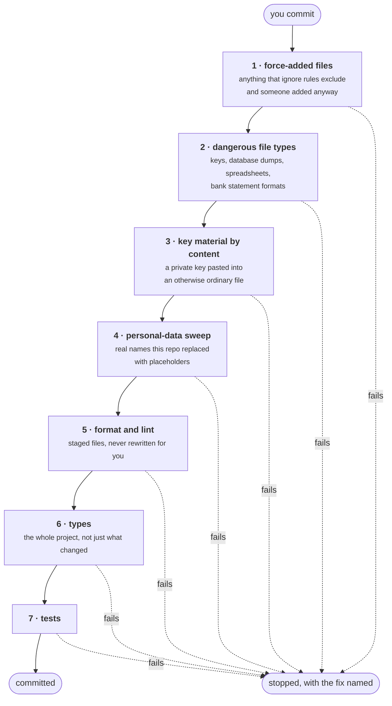
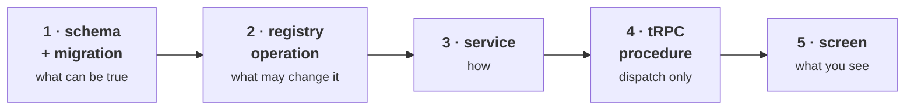

# Working on Waltning

Actively developed and changing fast. Read
[CONTRIBUTING.md](https://github.com/VoltLightning/waltning/blob/main/CONTRIBUTING.md)
and open an issue before building anything — contributions are welcome but not
solicited, and an unannounced pull request is likely to collide with work in
progress.

## The gate

```sh
pnpm verify        # formatting + lint + strict types + tests
```

**Never skip it.** There is no continuous integration server — no automated
build runs when you push. The pre-commit hook is the only automated thing
between an edit and the project's history, which is a deliberate decision with a
stated cost (see [[Decisions]]) and only works if the hook is treated as the CI
it replaces.

Here is what it actually does, in order. Everything must pass.



Two design choices in there are worth copying:

**It never rewrites your files.** A hook that silently reformats changes what
you are committing after you have read it. It fails and tells you which command
to run, so the commit stays yours.

**Types are checked across the whole project, not just staged files.** A type is
a property of the program. A file you changed can break a file you did not.

Database tests need PostgreSQL running (`pnpm db:up`). The hook does not skip
them when the database is unreachable, because a gate that disappears exactly
when someone is in a hurry is worse than no gate at all.

## Building a feature



In that order. It is a hard requirement, not a style note — **never start at the
screen.** Starting there produces an interface promising a number nothing
calculates, and the database then gets reshaped to fit a layout. Purely visual
work is the exception and starts where it says.

## Rules that will fail your commit

- **Amounts are exact decimals as strings**, and arithmetic goes through the
  money module. A JavaScript number holding an amount is a bug.
- **Accounting dates are plain `YYYY-MM-DD` strings.** No date arithmetic, no
  timezone conversion.
- **Every write is a registry entry** — named, validated, audited, with its
  offline eligibility declared. No direct database writes from a screen or from
  the assistant.
- **`any` and `!` are errors, not warnings.** Reach for a type parameter before
  `unknown`, `any` or `never`.
- **A new guarantee means a new database constraint** — and break it once, on
  purpose, to prove it fires.
- **No module imports another.** Compose them at the registry or in the route
  tree.
- **Import paths carry an explicit `.ts`** — *except* files that have
  platform-specific versions, which must have no extension. `./Button.tsx`
  silently ignores `Button.web.tsx` and nothing warns you.

## Migrations

Two files, and knowing which is which saves an hour.

| File | Nature |
|---|---|
| `0000_schema.sql` | **Generated.** Edit `schema.ts`, run `pnpm db:generate` |
| `0001_database_objects.sql` | **Hand-written.** Triggers, views, roles, permissions, and the checks the schema tool cannot express |

`pnpm db:reset` rebuilds from nothing.

Never use `drizzle-kit push`. It compares the schema file against the database
and applies the difference — but it cannot see triggers, views, permissions or
generated columns, which is to say it cannot see any of the guarantees. It would
report success and quietly remove them.

## When code and specification disagree

**Change the specification in the same pull request. Never silently.** The
specification is the design record. Code that quietly diverges turns it into
fiction, and the next person to trust it will be you, in six months, with no way
to tell which parts still hold.

## Reviewing

The review posture here is adversarial by default: **"looks good" is a
non-result.** The attack order is ranked by where this project has actually been
wrong, and the first item keeps paying:

**Search for the words *structurally*, *impossible*, *cannot*, *guaranteed*,
*never*, *always*.** For each one, ask which layer enforces it. "The document
says so" is a finding. That single check accounted for 28 of the register's
critical defects.

The fourth item is the one worth internalising:

> **Failure that looks like health.**
>
> A shared-expense account sitting at zero is both a correct balance and a
> transfer that credited nothing. A superuser connection makes every query
> succeed and every guarantee void. A gate with no input compares a number to
> itself and always passes.
>
> Of every success path, ask: *what would this look like if it were wrong?*

## Editing this wiki

**Do not edit pages here.** The source is
[`docs/wiki/`](https://github.com/VoltLightning/waltning/tree/main/docs/wiki) in
the repository, and publishing overwrites whatever the wiki holds.

That indirection is the point. A GitHub wiki is a separate repository, so the
pre-commit hook — the personal-data sweep in particular — cannot run on it. A
public surface for this project that no gate covers is not acceptable, so the
pages live where the gate is and are copied out by `pnpm wiki:publish`.
